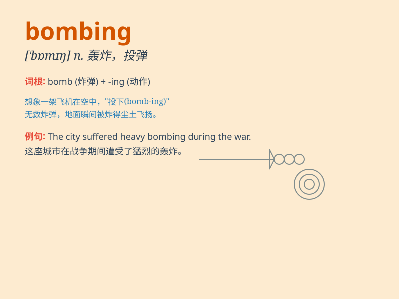

## bombing

**英音:** _[ˈbɒmɪŋ]_ **美音:** _[ˈbɑːmɪŋ]_

**译义:** *n.轰炸；投弹；爆炸声 vi.轰炸；投弹 vt.轰炸；投弹*

### 短语

+ **car bombing:** _汽车爆炸袭击_

+ **suicide bombing:** _自杀式爆炸_

+ **aerial bombing:** _空中轰炸_

+ **bombing raid:** _轰炸袭击_

+ **strategic bombing:** _战略轰炸_

### 例句

#### 例句1

> **The bombing of the city caused widespread destruction.**

**中文翻译:** 对这座城市的轰炸造成了大面积的破坏。

**单词释义:** 轰炸

#### 例句2

> **The terrorist bombing killed many innocent people.**

**中文翻译:** 恐怖分子的爆炸袭击致使许多无辜民众丧生。

**单词释义:** 爆炸袭击

#### 例句3

> **The country was under constant threat of bombing during the
war.**

**中文翻译:** 这个国家在战争期间一直处于遭受轰炸的威胁之下。

**单词释义:** 轰炸

### 背诵小故事

> In a war-torn city, there was constant bombing. One day, a brave
soldier named Tom witnessed the bombing and decided to protect his
comrades. The bombing was terrifying, but Tom\'s courage never wavered.

**在一个饱受战争蹂躏的城市，不断有轰炸。有一天，一位名叫汤姆的勇敢士兵目睹了轰炸，并决定保护他的战友。轰炸很可怕，但汤姆的勇气从未动摇。**

### 图义

