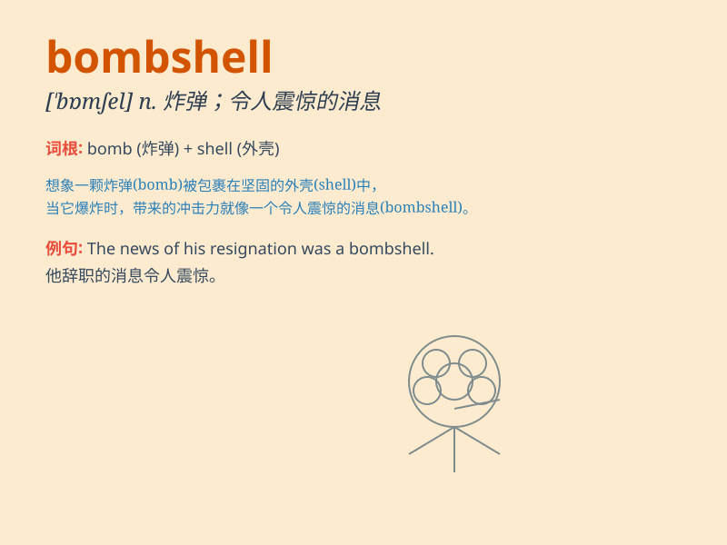

## bombshell

**英音:** _[\'bɒmʃel]_ **美音:** _[\'bɑmʃɛl]_

**译义:** *n.炸弹,突发而惊人的事物*

### 短语

+ **drop a bombshell:** _公布惊人的消息；突然宣布令人震惊的事_

+ **political bombshell:** _政治上的爆炸性事件_

+ **bombshell announcement:** _令人震惊的公告_

+ **bombshell news:** _爆炸性新闻_

+ **sexual bombshell:** _性丑闻_

### 例句

#### 例句1

> **The news of her resignation came as a bombshell.**

**中文翻译:** 她辞职的消息犹如重磅炸弹。

**单词释义:** 令人震惊的消息

#### 例句2

> **The report was a bombshell that exposed widespread
corruption.**

**中文翻译:** 这份报告是一个重磅炸弹，揭露了普遍存在的腐败现象。

**单词释义:** 惊人事件

#### 例句3

> **Her appearance at the party was a bombshell that turned all
heads.**

**中文翻译:** 她在聚会上的出现是一个重磅炸弹，吸引了所有人的目光。

**单词释义:** 惊人之举

### 背诵小故事

> In a quiet town, a mysterious package was delivered. When opened, it
turned out to be a bombshell that shocked everyone. It was like a sudden
explosion of unexpected news. Remember, \'bombshell\' means a shocking
surprise.

**在一个安静的小镇，一个神秘包裹被送达。打开后，发现是个重磅炸弹，震惊了所有人。就像突然爆发的意外消息。记住，\'bombshell\'意思是令人震惊的意外之事。**

### 图义

