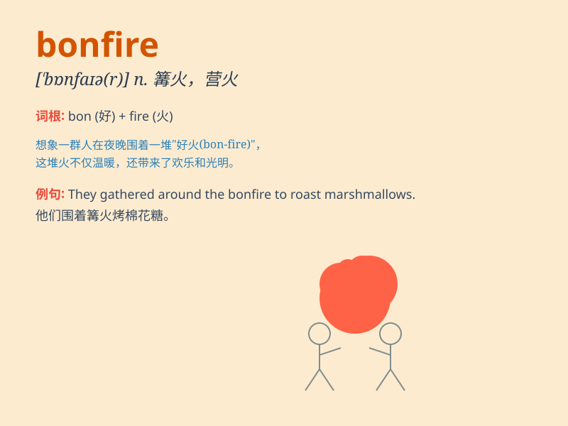

## bonfire

**英音:** _[\'bɒnfaɪə]_ **美音:** _[\'bɑnfaɪɚ]_

**译义:** *n.大篝火,营火*

### 短语

+ **light a bonfire:** _点燃篝火_

+ **build a bonfire:** _搭建篝火_

+ **sit around a bonfire:** _围坐在篝火旁_

+ **bonfire party:** _篝火晚会_

+ **bonfire night:** _篝火之夜_

### 例句

#### 例句1

> **We gathered around the bonfire to keep warm on the chilly
night.**

**中文翻译:** 在寒冷的夜晚，我们围坐在篝火旁取暖。

**单词释义:** 篝火

#### 例句2

> **The children were excited to light the bonfire for the
campout.**

**中文翻译:** 孩子们兴奋地为露营点燃篝火。

**单词释义:** 篝火

#### 例句3

> **The bonfire illuminated the beach, creating a magical
atmosphere.**

**中文翻译:** 篝火照亮了海滩，营造出一种神奇的氛围。

**单词释义:** 篝火

### 背诵小故事

> One cold night, Tom was lost in the forest. Suddenly, he saw a
bonfire in the distance. He ran towards it and felt warm. The bonfire
saved him from the cold and darkness.

**一个寒冷的夜晚，汤姆在森林里迷路了。突然，他看到远处有一堆篝火。他朝它跑去，感到很温暖。篝火让他摆脱了寒冷和黑暗。**

### 图义

