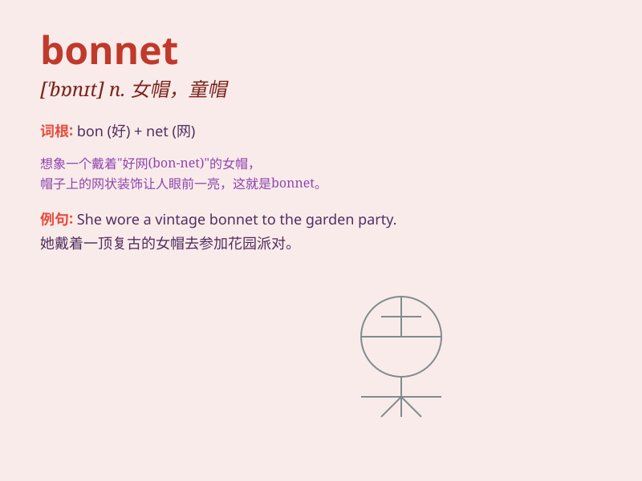

## bonnet

**英音:** _[\'bɒnɪt]_ **美音:** _[\'bɑnət]_

**译义:** *n.无边女帽,童帽,烟囱帽,阀帽*

### 短语

+ **engine bonnet:** _发动机罩_

+ **bonnet lock:** _引擎盖锁_

+ **bonnet catch:** _引擎盖扣_

+ **bonnet stay:** _引擎盖撑杆_

+ **bonnet opener:** _引擎盖开启器_

### 例句

#### 例句1

> **She wore a pretty bonnet on her head.**

**中文翻译:** 她头上戴着一顶漂亮的女帽。

**单词释义:** 女帽

#### 例句2

> **The car\'s bonnet was dented in the accident.**

**中文翻译:** 在事故中，汽车的引擎盖凹陷了。

**单词释义:** 引擎盖

#### 例句3

> **The baby was sleeping peacefully under the bonnet of the
pram.**

**中文翻译:** 婴儿在婴儿车的遮阳篷下安静地睡着。

**单词释义:** 遮阳篷

### 背诵小故事

> A little girl was wearing a pretty bonnet and running in the garden.
Suddenly, a gust of wind blew her bonnet away. She chased after it
happily. The bonnet finally landed on a branch.

**一个小女孩戴着一顶漂亮的帽子在花园里跑。突然，一阵风把她的帽子吹走了。她开心地追着它。帽子最后落在了一根树枝上。**

### 图义

