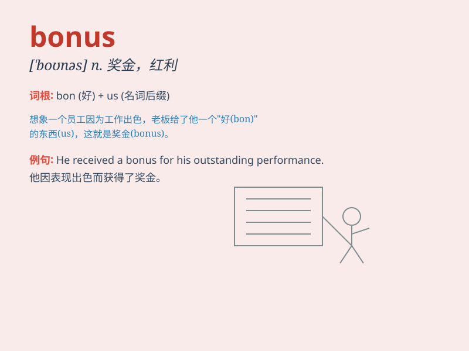

## bonus

**英音:** _[\'bəʊnəs]_ **美音:** _[\'bonəs]_

**译义:** *n.奖金,红利*

### 短语

+ **bonus point:** _加分；奖励分_

+ **annual bonus:** _年终奖金_

+ **cash bonus:** _现金奖励_

+ **bonus system:** _奖金制度_

+ **performance bonus:** _绩效奖金_

### 例句

#### 例句1

> **The company gave its employees a year-end bonus to thank them for
their hard work.**

**中文翻译:** 公司给员工发放了年终奖金以感谢他们的辛勤工作。

**单词释义:** 奖金；红利

#### 例句2

> **As a bonus, you\'ll get a free gift with your purchase.**

**中文翻译:** 作为额外的奖励，您购买时将获得一份免费礼物。

**单词释义:** 额外的好处；奖励

#### 例句3

> **His good performance earned him a bonus point in the
competition.**

**中文翻译:** 他的出色表现为他在比赛中赢得了加分。

**单词释义:** 加分；额外的分数

### 背诵小故事

> A hardworking employee was always dedicated to his job. One day, the
boss gave him a bonus as a reward for his excellent performance. The
bonus made him very happy and motivated.

**一位勤奋的员工总是全身心投入工作。有一天，老板给了他一笔奖金作为对他出色表现的奖励。这笔奖金让他非常高兴并且更有动力了。**

### 图义

