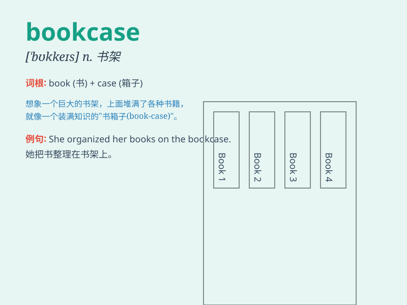

## bookcase

**英音:** _[\'bʊkkeɪs]_ **美音:** _[\'bʊkkes]_

**译义:** *n.书架,书柜*

### 短语

+ **wooden bookcase:** _木制书柜_

+ **small bookcase:** _小书柜_

+ **modern bookcase:** _现代书柜_

+ **wall-mounted bookcase:** _壁挂式书柜_

+ **glass-fronted bookcase:** _玻璃门书柜_

### 例句

#### 例句1

> **The bookcase in my bedroom is full of novels.**

**中文翻译:** 我卧室里的书柜装满了小说。

**单词释义:** 书柜

#### 例句2

> **I need to buy a new bookcase for my study room.**

**中文翻译:** 我需要为我的书房买一个新的书柜。

**单词释义:** 书柜

#### 例句3

> **He spent the whole afternoon assembling the bookcase.**

**中文翻译:** 他花了整个下午组装这个书柜。

**单词释义:** 书柜

### 背诵小故事

> One day, Tom was looking for his favorite book but couldn\'t find it.
Then he remembered he put it in the bookcase. The bookcase was like a
treasure chest full of knowledge and stories.

**一天，汤姆在找他最喜欢的书但找不到。然后他想起把它放在书柜里了。这个书柜就像一个装满知识和故事的宝箱。**

### 图义

