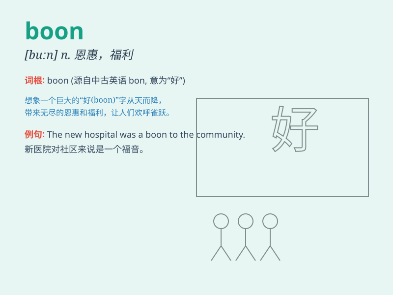

## boon

**英音:** _[buːn]_ **美音:** _[bʊn]_

**译义:** *n.恩惠,实惠,福利*

### 短语

+ **a boon companion:** _愉快的伙伴_

+ **boon in disguise:** _因祸得福；看似不幸实则有益的事_

+ **be a boon to:** _对\...有裨益；是\...的福音_

+ **grant a boon:** _赐予恩惠_

+ **ask for a boon:** _请求恩赐_

### 例句

#### 例句1

> **The new law is a boon for small businesses.**

**中文翻译:** 新法律对小企业来说是一项福利。

**单词释义:** 福利；恩赐

#### 例句2

> **Rainy days are a boon for farmers during a drought.**

**中文翻译:** 在干旱期间，下雨天对农民来说是一种恩赐。

**单词释义:** 恩赐；有益的东西

#### 例句3

> **The invention of the internet has been a boon to
communication.**

**中文翻译:** 互联网的发明对于通信来说是一大福音。

**单词释义:** 福音；好处

### 背诵小故事

>
有一天，小明在森林中迷路了，又饿又累。这时，他发现了一棵结满果实的树，这棵树成了他生存的救星。这棵树的存在就是一个'boon'，意思是恩惠、福利。

**有一天，小明在森林中迷路，又饿又累时发现一棵结满果实的树，这棵树成为他的救星，这就是'boon'（恩惠、福利）**

### 图义

