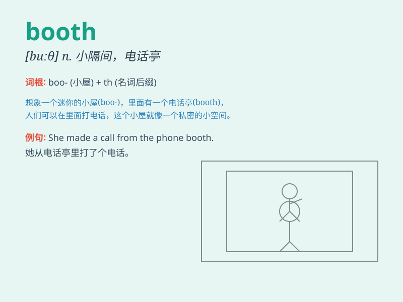

## booth

**英音:** _[buːð; buːθ]_ **美音:** _[bʊθ]_

**译义:** *n.货摊,售货亭,棚*

### 短语

+ **phone booth:** _公用电话亭_

+ **ticket booth:** _售票亭_

+ **polling booth:** _投票站_

+ **information booth:** _问讯处_

+ **booth attendant:** _摊位服务员_

### 例句

#### 例句1

> **I called her from a phone booth.**

**中文翻译:** 我在一个电话亭给她打了电话。

**单词释义:** 电话亭

#### 例句2

> **The voting booth was set up in the school gymnasium.**

**中文翻译:** 投票亭设在学校体育馆里。

**单词释义:** 投票亭

#### 例句3

> **He sat in the booth at the corner of the restaurant.**

**中文翻译:** 他坐在餐厅角落的卡座里。

**单词释义:** 卡座

### 背诵小故事

> A man was lost in a fair. He was looking for a phone booth to call
his friend for help. Finally, he found it and was able to get in touch.

**一个男人在集市上迷路了。他正在寻找一个电话亭来给他的朋友打电话求助。最后，他找到了，并得以取得联系。**

### 图义

