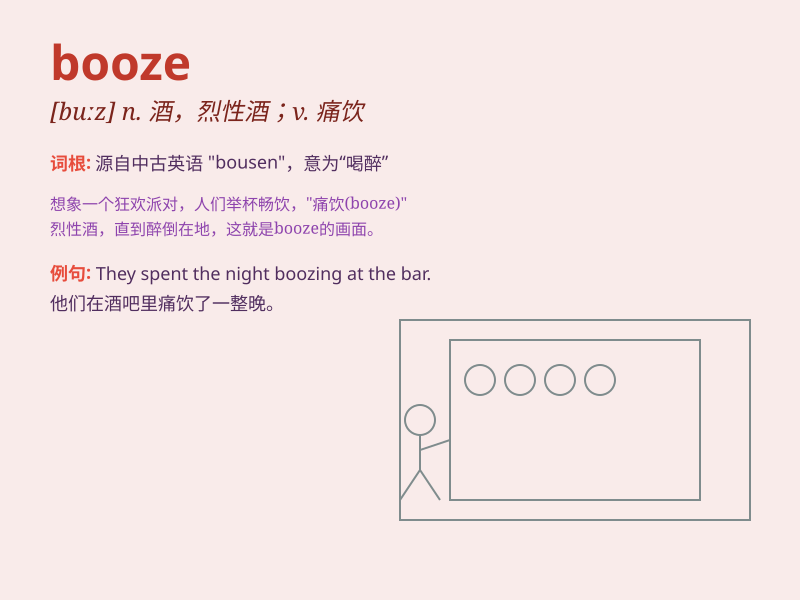

## booze

**英音:** _[buːz]_ **美音:** _[buːz]_

**译义:** *vi.\<俗>豪饮n.酒,酒宴*

### 短语

+ **booze up:** _狂饮；痛饮_

+ **booze cruise:** _（到国外买廉价酒的）买酒之旅_

+ **booze party:** _酒会；饮酒聚会_

+ **on the booze:** _狂饮；酗酒_

+ **booze bender:** _长时间酗酒；连续饮酒狂欢_

### 例句

#### 例句1

> **He spent the weekend indulging in booze.**

**中文翻译:** 他整个周末都在纵情饮酒。

**单词释义:** 酒；酒精饮料

#### 例句2

> **The party was filled with booze and music.**

**中文翻译:** 派对上满是酒和音乐。

**单词释义:** 酒

#### 例句3

> **She quit drinking booze to improve her health.**

**中文翻译:** 她戒酒以改善健康状况。

**单词释义:** 酒；含酒精饮料

### 背诵小故事

> One day, Tom was very sad. His friend Jack came and gave him some
booze. Tom drank it and felt better. But he knew he couldn\'t rely on
booze to solve problems all the time.

**一天，汤姆非常伤心。他的朋友杰克过来给了他一些酒。汤姆喝了之后感觉好了些。但他知道他不能一直依靠酒来解决问题。**

### 图义

