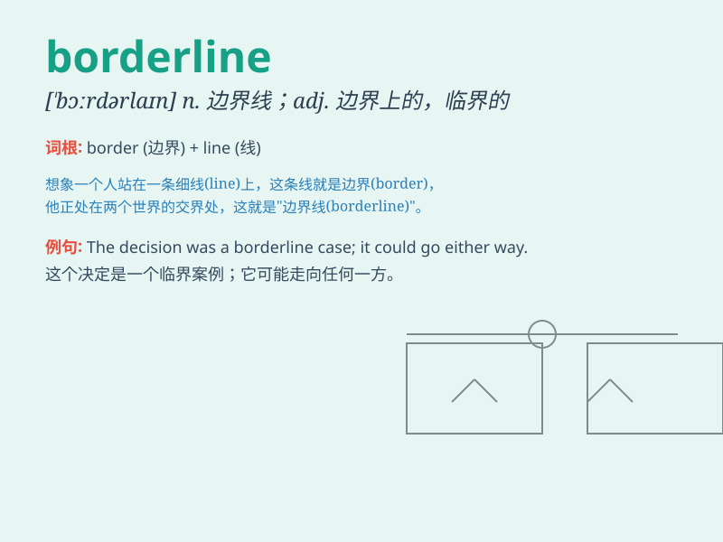

## borderline

**英音:** _[\'bɔːdəlaɪn]_ **美音:** _[\'bɔrdɚlaɪn]_

**译义:** *n.边界线*

### 短语

+ **borderline case:** _难以界定的情况；两可情况_

+ **borderline personality:** _边缘型人格_

+ **borderline state:** _边缘状态_

+ **borderline hypertension:** _临界性高血压_

+ **borderline intelligence:** _临界智力_

### 例句

#### 例句1

> **Her behavior was on the borderline between acceptable and
unacceptable.**

**中文翻译:** 她的行为处于可接受与不可接受之间的边界。

**单词释义:** 介于两者之间的界限；边缘

#### 例句2

> **The patient\'s condition is borderline stable.**

**中文翻译:** 病人的状况近乎稳定。

**单词释义:** 接近某种状态的；不确定的

#### 例句3

> **His score was borderline passing.**

**中文翻译:** 他的分数接近及格。

**单词释义:** 接近；近乎

### 背诵小故事

> A young artist was always on the borderline between success and
failure. One day, he decided to cross that line and worked hard.
Finally, his artworks were widely praised. The borderline no longer
limited him.

**一位年轻的艺术家总是处于成功与失败的边缘。有一天，他决定跨越这条线并努力工作。最终，他的艺术作品广受赞誉。这条边界线不再限制他。**

### 图义

