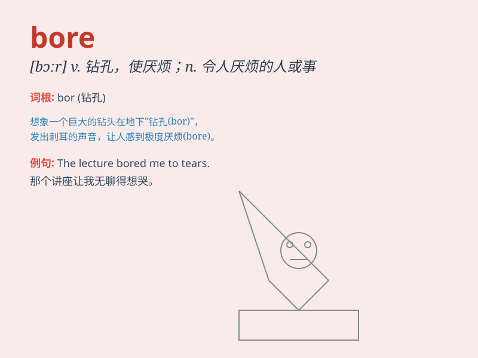

## bore

**英音:** _[bɔː]_ **美音:** _[bɔr]_

**译义:** *n.令人讨厌的人,怒潮,枪膛,孔v.使烦扰,钻孔 钻孔*

### 短语

+ **bore sb. to death:** _使某人厌烦得要死_

+ **be bored with:** _对\...\...感到厌烦_

+ **bore a hole:** _钻一个洞_

+ **a bored expression:** _厌烦的表情_

+ **bore through:** _穿过；钻通_

### 例句

#### 例句1

> **I\'m bored with this TV show.**

**中文翻译:** 我对这个电视节目感到厌烦了。

**单词释义:** 感到厌烦

#### 例句2

> **The lecture was so boring that many students fell asleep.**

**中文翻译:** 讲座太无聊了，很多学生都睡着了。

**单词释义:** 无聊的

#### 例句3

> **He used to bore me with his endless complaints.**

**中文翻译:** 他常常用没完没了的抱怨让我厌烦。

**单词释义:** 使厌烦

### 背诵小故事

> A strong bear was constantly digging holes in the ground, which was
so boring. But then, it found a hidden treasure, making the boring
digging worthwhile. The act of constantly digging is like \'bore\',
meaning to make someone feel dull or tired.

**一只强壮的熊一直在地上挖洞，这很无聊。但后来，它发现了一个隐藏的宝藏，让这无聊的挖掘变得有价值。不断挖掘的行为就像'bore'，意思是使某人感到厌烦或疲倦。**

### 图义

