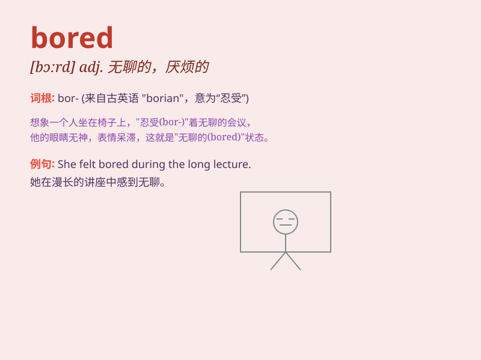

## bored

**英音:** _[bɔːd]_ **美音:** _[bɔrd]_

**译义:** *adj.无聊的,无趣的,烦人的,*

### 短语

+ **be bored with:** _对\...\...感到厌烦_

+ **bored stiff:** _非常厌烦；极其无聊_

+ **bored to death:** _无聊死了_

+ **get bored:** _变得厌倦；感到无聊_

+ **bored look:** _厌烦的表情_

### 例句

#### 例句1

> **I\'m bored with this book. **

**中文翻译:** 我对这本书感到厌烦了。

**单词释义:** 感到厌烦的

#### 例句2

> **She was bored at the party. **

**中文翻译:** 她在聚会上很无聊。

**单词释义:** 无聊的

#### 例句3

> **He looked bored when listening to the lecture. **

**中文翻译:** 他听讲座时显得很无聊。

**单词释义:** 厌烦的

### 背诵小故事

> One day, Tom had to stay at home alone and do nothing. He felt so
bored. There were no interesting games or shows. He just sat there,
sighing and longing for something exciting to happen.

**有一天，汤姆不得不独自待在家里，无事可做。他感到非常无聊。没有有趣的游戏或节目。他就坐在那里，叹气并渴望有刺激的事情发生。**

### 图义

