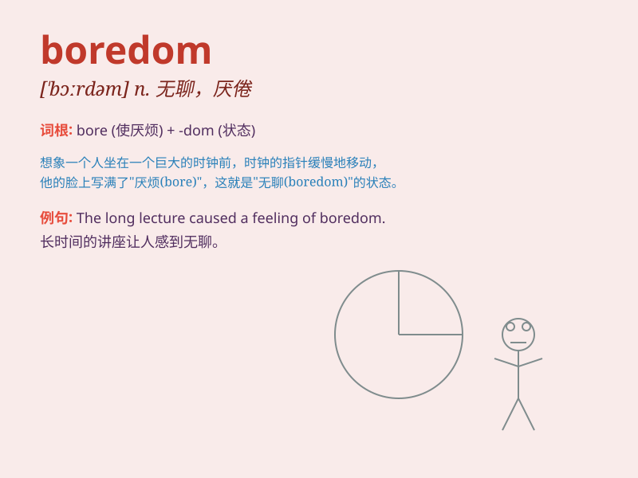

## boredom

**英音:** _[\'bɔːdəm]_ **美音:** _[\'bɔrdəm]_

**译义:** *n.厌倦*

### 短语

+ **relieve boredom:** _缓解无聊_

+ **suffer from boredom:** _受无聊之苦_

+ **escape boredom:** _逃避无聊_

+ **endless boredom:** _无尽的无聊_

+ **deep boredom:** _深深的无聊_

### 例句

#### 例句1

> **The boredom of the long lecture made many students fall
asleep.**

**中文翻译:** 长时间的讲座的无聊让很多学生都睡着了。

**单词释义:** 无聊；厌烦

#### 例句2

> **She tried to escape the boredom of her daily routine.**

**中文翻译:** 她试图摆脱日常生活中的无聊。

**单词释义:** 无聊；乏味

#### 例句3

> **His life was filled with boredom and monotony.**

**中文翻译:** 他的生活充满了无聊和单调。

**单词释义:** 无聊；烦闷

### 背诵小故事

> One day, Tom was stuck at home with nothing to do. He felt a strange
feeling, which was boredom. He was so tired of the same old things and
just wanted some excitement. Finally, he decided to go out and find
something fun.

**有一天，汤姆被困在家里无事可做。他感觉到一种奇怪的感觉，那就是无聊。他厌倦了一成不变的事情，只想来点刺激的。最后，他决定出去找点好玩的。**

### 图义

