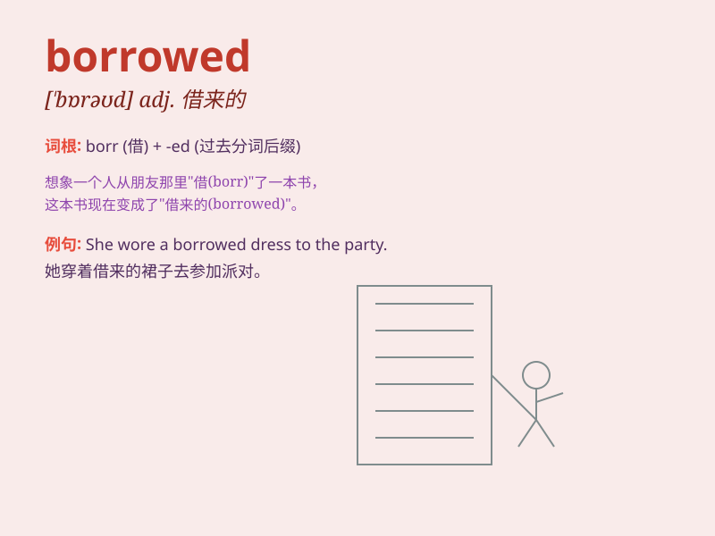

## borrowed

**英音:** _[\'bɒrəʊd]_ **美音:** _[\'bɑro]_

**译义:** *adj.借来的,虚构的,伪造的*

### 短语

+ **borrowed time:**
_（比预期存活或成功的时间）多出来的时间；苟延残喘的时间_

+ **borrowed money:** _借来的钱_

+ **borrowed idea:** _借鉴的想法；借用的主意_

+ **borrowed book:** _借来的书_

+ **borrowed clothes:** _借来的衣服_

### 例句

#### 例句1

> **I borrowed a pen from my classmate.**

**中文翻译:** 我向同学借了一支笔。

**单词释义:** 借（入）

#### 例句2

> **She borrowed some money to buy a new dress.**

**中文翻译:** 她借了一些钱买了一件新衣服。

**单词释义:** 借（入）

#### 例句3

> **He borrowed the idea from an old book.**

**中文翻译:** 他从一本旧书中借用了这个想法。

**单词释义:** 借鉴；借用

### 背诵小故事

> One day, Tom needed a pen for his exam. So he went to his friend Lily
and borrowed a nice pen from her. After the exam, he returned it and
thanked Lily.

**有一天，汤姆考试需要一支笔。于是他去找他的朋友莉莉，从她那里借了一支好看的笔。考试结束后，他归还了笔并感谢了莉莉。**

### 图义

