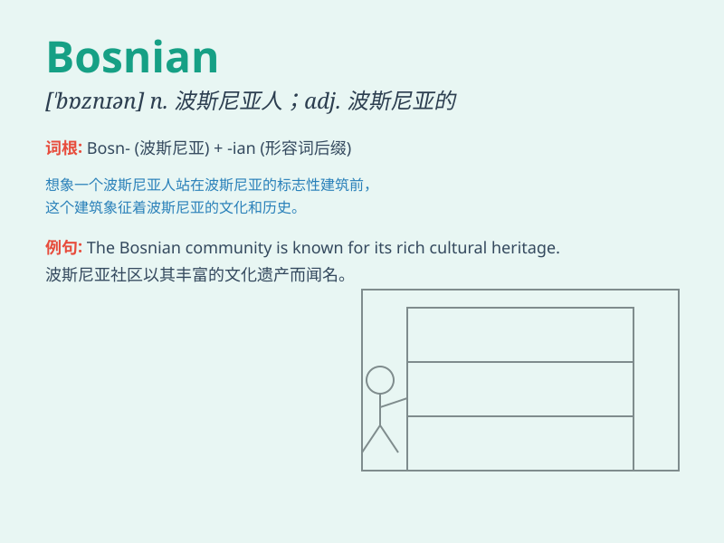

## Bosnian

**英音:** _[ˈbɒznɪən]_ **美音:** _[ˈbɑːznɪən]_

**译义:** *n. 波斯尼亚人, 波斯尼亚语 adj. 波斯尼亚的, 波斯尼亚人的,
波斯尼亚语的*

### 短语

+ **Bosnian War:** _波斯尼亚战争_

+ **Bosnian language:** _波斯尼亚语_

+ **Bosnian crisis:** _波斯尼亚危机_

+ **Bosnian Muslims:** _波斯尼亚穆斯林_

+ **Bosnian Croats:** _波斯尼亚克族人_

### 例句

#### 例句1

> **The Bosnian war was a tragic conflict.**

**中文翻译:** 波黑战争是一场悲惨的冲突。

**单词释义:** 波黑的；波黑人

#### 例句2

> **She is an expert in Bosnian history.**

**中文翻译:** 她是波黑历史方面的专家。

**单词释义:** 波黑的

#### 例句3

> **The Bosnian language has some unique features.**

**中文翻译:** 波黑语有一些独特的特征。

**单词释义:** 波黑的

### 背诵小故事

> Imagine you are on a trip to a beautiful place. You meet a friendly
local who introduces himself as Bosnian. He shows you around and tells
you about the unique culture of his homeland. Now you remember Bosnian
means a person from Bosnia.

**想象你在一次旅行中去到一个美丽的地方。你遇到一位友好的当地人，他自我介绍是波西尼亚人。他带你四处参观，并给你讲述他家乡独特的文化。现在你记住了
Bosnian 指的是来自波西尼亚的人。**

### 图义

