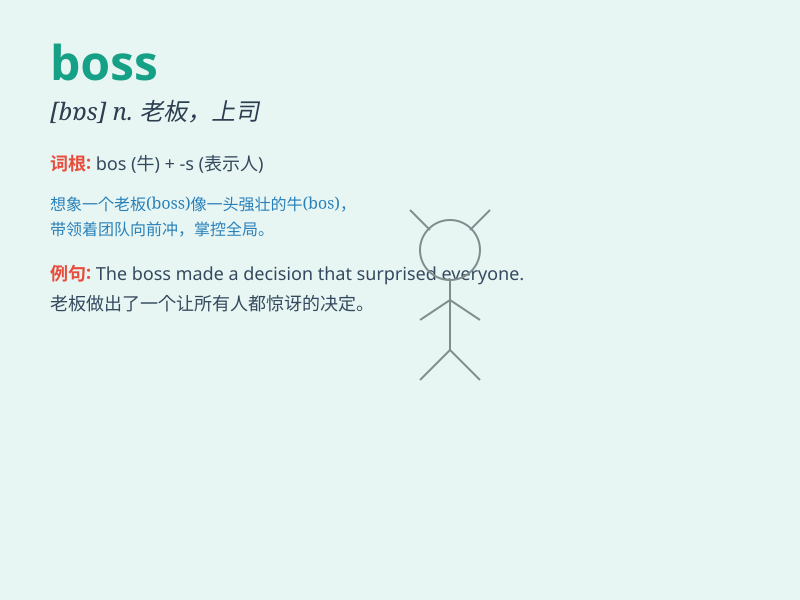

## boss

**英音:** _[bɒs]_ **美音:** _[bɑs]_

**译义:** *n.老板,上司vt.指挥*

### 短语

+ **boss around:** _随意指使；把...差来遣去_

+ **boss somebody up:** _督促某人；使某人振作_

+ **be one\'s own boss:** _自己当老板；自主行事_

+ **boss man:** _老板；上司_

+ **boss lady:** _女老板；女上司_

### 例句

#### 例句1

> **The boss is very strict with us.**

**中文翻译:** 老板对我们要求很严格。

**单词释义:** 老板；上司

#### 例句2

> **He is the boss of this company.**

**中文翻译:** 他是这家公司的老板。

**单词释义:** 老板；负责人

#### 例句3

> **She bossed the project very well.**

**中文翻译:** 她很好地主持了这个项目。

**单词释义:** 指挥；管理

### 背诵小故事

>
想象一下，在一个大公司里，有个总是穿着精致西装、发号施令的人，大家都对他敬畏有加，他就是
boss。他决定着员工的工作安排和公司的发展方向，拥有绝对的权威。

**想象在一个大公司中，有个总是穿着精致西装、发号施令，让大家敬畏，决定员工工作安排和公司发展方向、拥有绝对权威的人，这就是老板。**

### 图义

