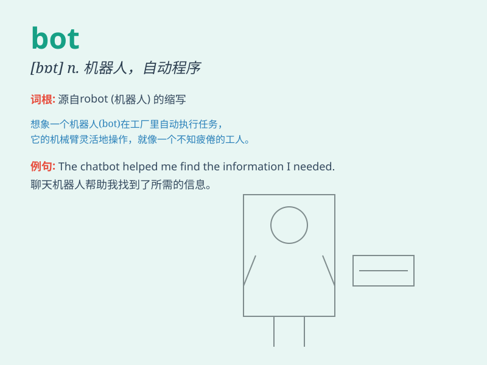

## bot

**英音:** _[bɒt]_ **美音:** _[bɑt]_

**译义:** *n.肤蝇的幼虫,马胃蝇蛆*

### 短语

+ **chat bot:** _聊天机器人_

+ **search bot:** _搜索机器人_

+ **Twitter bot:** _推特机器人_

+ **malicious bot:** _恶意机器人_

+ **automated bot:** _自动化机器人_

### 例句

#### 例句1

> **The bot can answer various questions.**

**中文翻译:** 该机器人可以回答各种问题。

**单词释义:** 机器人

#### 例句2

> **This software is like a bot that automates tasks.**

**中文翻译:** 该软件就像一个自动执行任务的机器人。

**单词释义:** 机器人程序

#### 例句3

> **The trading bot made several successful transactions.**

**中文翻译:** 交易机器人进行了几笔成功的交易。

**单词释义:** 机器人（用于特定交易等场景）

### 背诵小故事

> Imagine a robot in a big factory. It works non-stop, doing repetitive
tasks. We call this hardworking robot a \'bot\'. It has no feelings but
is very efficient.

**想象一个在大工厂里的机器人。它不停地工作，做着重复的任务。我们把这个勤劳的机器人称为'bot'。它没有感情但效率很高。**

### 图义

