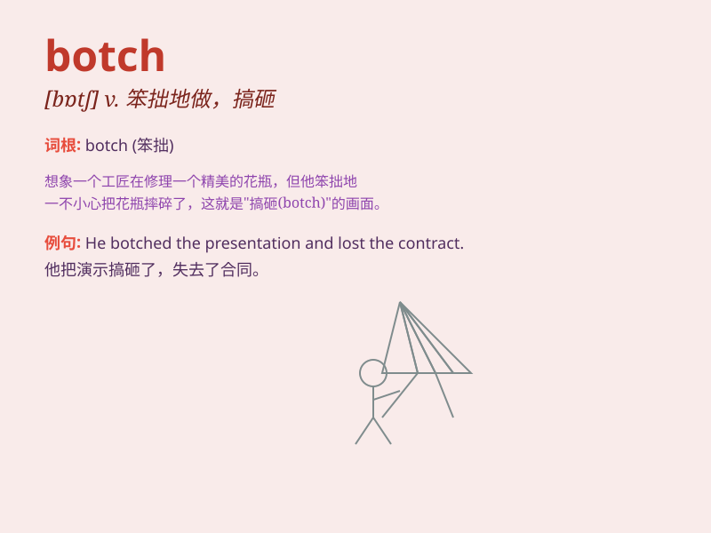

## botch

**英音:** _[bɒtʃ]_ **美音:** _[bɑtʃ]_

**译义:** *v.修补*

### 短语

+ **botch up:** _搞糟，弄坏_

+ **botch job:** _拙劣的工作_

+ **botch something together:** _匆忙拼凑某物_

+ **botch the attempt:** _搞砸尝试_

+ **botch the deal:** _弄糟交易_

### 例句

#### 例句1

> **He botched the repair job and made it worse.**

**中文翻译:** 他把修理工作搞砸了，使情况变得更糟。

**单词释义:** 搞砸，弄糟

#### 例句2

> **The tailor botched the hem of my dress.**

**中文翻译:** 裁缝把我裙子的下摆弄坏了。

**单词释义:** 弄坏，搞坏

#### 例句3

> **They botched their attempt to climb the mountain.**

**中文翻译:** 他们爬山的尝试失败了。

**单词释义:** 把\...\...搞坏，弄糟

### 背诵小故事

> A clumsy carpenter always botched his work. He tried to build a table
but made a mess of it, with uneven legs and rough surfaces. Poor guy! It
shows how \'botch\' means to do a job badly and spoiling it.

**一位笨拙的木匠总是把工作搞砸。他试图做一张桌子，结果却弄得一团糟，桌腿不平整，表面粗糙。可怜的家伙！这表明'botch'意思是把工作做得很差并搞砸。**

### 图义

