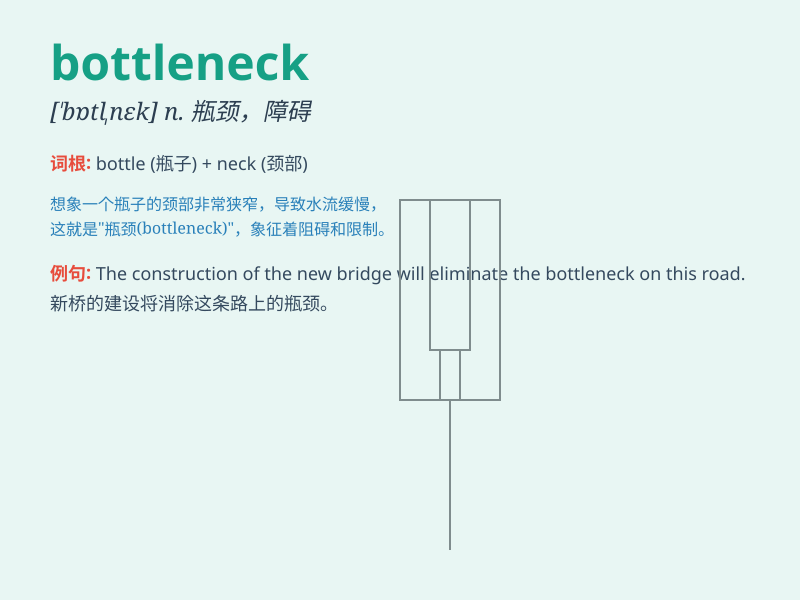

## bottleneck

**英音:** _[\'bɒt(ə)lnek]_ **美音:** _[\'bɑtlnɛk]_

**译义:** *n.瓶颈*

### 短语

+ **traffic bottleneck:** _交通瓶颈_

+ **production bottleneck:** _生产瓶颈_

+ **bottleneck problem:** _瓶颈问题_

+ **break the bottleneck:** _打破瓶颈_

+ **bottleneck restriction:** _瓶颈限制_

### 例句

#### 例句1

> **Traffic congestion at the intersection has become a bottleneck
for commuters.**

**中文翻译:** 十字路口的交通拥堵已成为通勤者的瓶颈。

**单词释义:** 瓶颈；障碍

#### 例句2

> **The production line was often halted due to a bottleneck in the
supply of raw materials.**

**中文翻译:** 由于原材料供应瓶颈，生产线经常停工。

**单词释义:** 瓶颈；阻碍

#### 例句3

> **The narrow bridge is a bottleneck in the transportation system of
the town.**

**中文翻译:** 窄桥是该镇交通系统的瓶颈。

**单词释义:** 瓶颈；狭窄处

### 背诵小故事

>
想象一下，在一条繁忙的公路上，有一个狭窄的路段，车辆都在这里被堵住，难以通行。这个狭窄路段就是\'bottleneck\'，就像瓶口一样限制了流量。

**想象在公路上有个狭窄路段导致车辆堵塞的情景来记住'瓶颈；障碍'这个单词**

### 图义

