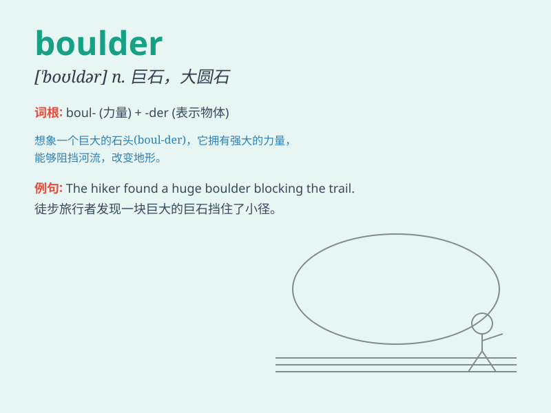

## boulder

**英音:** _[\'bəʊldə]_ **美音:** _[\'boldɚ]_

**译义:** *n.大石头,漂石*

### 短语

+ **giant boulder:** _巨大的巨石_

+ **smooth boulder:** _光滑的巨石_

+ **round boulder:** _圆形的巨石_

+ **weathered boulder:** _风化的巨石_

+ **movable boulder:** _可移动的巨石_

### 例句

#### 例句1

> **The climber struggled to scale the huge boulder.**

**中文翻译:** 登山者奋力攀爬那块巨石。

**单词释义:** 巨石

#### 例句2

> **A boulder rolled down the mountain and blocked the road.**

**中文翻译:** 一块巨石从山上滚下来，挡住了路。

**单词释义:** 巨石

#### 例句3

> **They sat on a boulder and enjoyed the view of the valley.**

**中文翻译:** 他们坐在一块巨石上，欣赏着山谷的景色。

**单词释义:** 巨石

### 背诵小故事

> A brave adventurer was hiking in the mountains. Suddenly, a huge
boulder rolled down towards him. He narrowly escaped, remembering the
word \'boulder\' as the big, scary rock that almost got him.

**一位勇敢的冒险家正在山里徒步。突然，一块巨大的巨石朝他滚来。他侥幸逃脱，记住了'boulder'这个词，就是那块差点砸到他的大而可怕的岩石。**

### 图义

