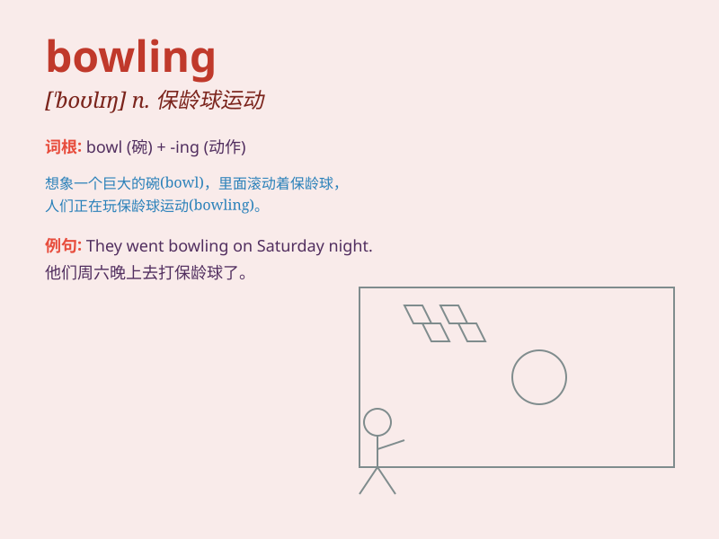

## bowling

**英音:** _[\'bəʊlɪŋ]_ **美音:** _[\'bolɪŋ]_

**译义:** *n.保龄球*

### 短语

+ **bowling alley:** _保龄球馆_

+ **bowling ball:** _保龄球_

+ **bowling green:** _草地滚球场_

+ **bowling pin:** _保龄球瓶_

+ **go bowling:** _去打保龄球_

### 例句

#### 例句1

> **I enjoy going bowling with my friends on weekends.**

**中文翻译:** 我喜欢周末和朋友们一起去打保龄球。

**单词释义:** 保龄球运动

#### 例句2

> **The bowling alley was crowded last night.**

**中文翻译:** 昨晚保龄球馆里挤满了人。

**单词释义:** 保龄球馆

#### 例句3

> **She has excellent bowling skills.**

**中文翻译:** 她拥有出色的保龄球技巧。

**单词释义:** 保龄球技巧

### 背诵小故事

> One day, Tom went to a place full of excitement. There were people
throwing heavy balls down a long lane. It was called bowling. Tom was
amazed and decided to try it himself. He had so much fun!

**有一天，汤姆去了一个充满兴奋的地方。那里有人沿着长长的通道扔重球。这就叫保龄球。汤姆很惊讶，决定自己试试。他玩得非常开心！**

### 图义

