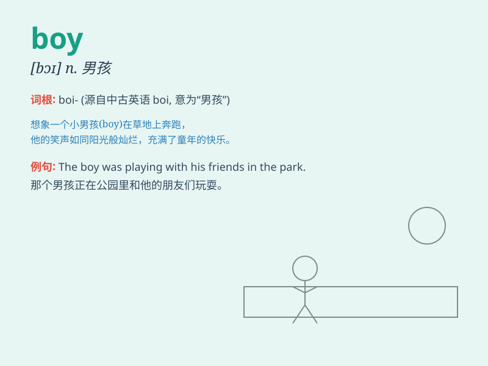

## boy

**英音:** _[bɒɪ]_ **美音:** _[bɔɪ]_

**译义:** *n.男孩,儿子,孩子气的人,男仆*

### 短语

+ **little boy:** _小男孩_

+ **boy friend:** _男朋友_

+ **paper boy:** _报童_

+ **delivery boy:** _送货员_

+ **office boy:** _勤杂工_

### 例句

#### 例句1

> **The boy is playing football in the park.**

**中文翻译:** 这个男孩正在公园里踢足球。

**单词释义:** 男孩

#### 例句2

> **That tall boy is my classmate.**

**中文翻译:** 那个高个子男孩是我的同学。

**单词释义:** 男孩

#### 例句3

> **The little boy lost his way home.**

**中文翻译:** 这个小男孩迷路了。

**单词释义:** 男孩

### 背诵小故事

> A little boy was lost in the forest. He was scared but brave. He kept
walking and finally found a way out. Remember, \'boy\' is a young male
child.

**一个小男孩在森林里迷路了。他很害怕但很勇敢。他一直走，最后找到了出路。记住，\'boy\'就是年轻的男孩子。**

### 图义

