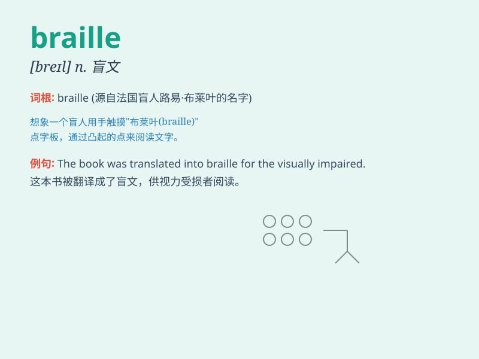

## braille

**英音:** _[breɪl]_ **美音:** _[breɪl]_

**译义:** *n.盲人用点字法vt.用盲字印*

### 短语

+ **Braille alphabet:** _盲文字母表_

+ **Braille system:** _盲文系统_

+ **Braille writing:** _盲文书写_

+ **learn Braille:** _学习盲文_

+ **Braille book:** _盲文书_

### 例句

#### 例句1

> **The library has a large collection of books in Braille.**

**中文翻译:** 图书馆有大量的盲文书籍收藏。

**单词释义:** 盲文

#### 例句2

> **She learned to read and write Braille at a young age.**

**中文翻译:** 她在很小的时候就学会了读和写盲文。

**单词释义:** 盲文

#### 例句3

> **The Braille system helps visually impaired people access
knowledge.**

**中文翻译:** 盲文系统帮助视障人士获取知识。

**单词释义:** 盲文

### 背诵小故事

>
有个失明的小孩叫小明，他渴望学习知识。一天，他得到了一本特殊的书，上面的
braille 盲文让他能'看'懂文字。通过努力，小明凭借 braille
走进了精彩的知识世界。

**有个失明的小孩小明，得到有盲文（braille）的书，通过努力学习走进知识世界。**

### 图义

