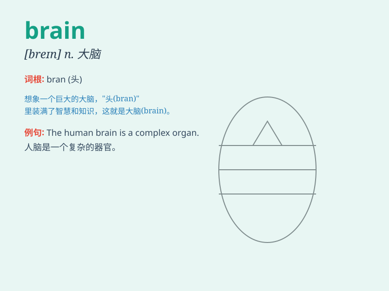

## brain

**英音:** _[breɪn]_ **美音:** _[bren]_

**译义:** *n.脑,头脑*

### 短语

+ **brain drain:** _人才外流；智囊流失_

+ **brain storm:** _头脑风暴；集思广益_

+ **on the brain:** _念念不忘；着迷_

+ **rack one\'s brain:** _绞尽脑汁；苦思冥想_

+ **pick someone\'s brain:** _请教某人；向某人取经_

### 例句

#### 例句1

> **He\'s got a brilliant brain.**

**中文翻译:** 他有一个聪明的头脑。

**单词释义:** 头脑；智力

#### 例句2

> **The brain is the control centre of the body.**

**中文翻译:** 大脑是身体的控制中心。

**单词释义:** 大脑

#### 例句3

> **Use your brain and think of a solution.**

**中文翻译:** 动动脑筋，想一个解决办法。

**单词释义:** 头脑；智力

### 背诵小故事

> One day, a little mouse was looking for food. It needed to use its
brain to find the best way. Finally, with its smart brain, it discovered
a hidden cheese. The mouse was so happy!

**有一天，一只小老鼠正在寻找食物。它需要运用它的大脑来找到最佳的方法。最后，凭借聪明的大脑，它发现了一块隐藏的奶酪。小老鼠非常高兴！**

### 图义

