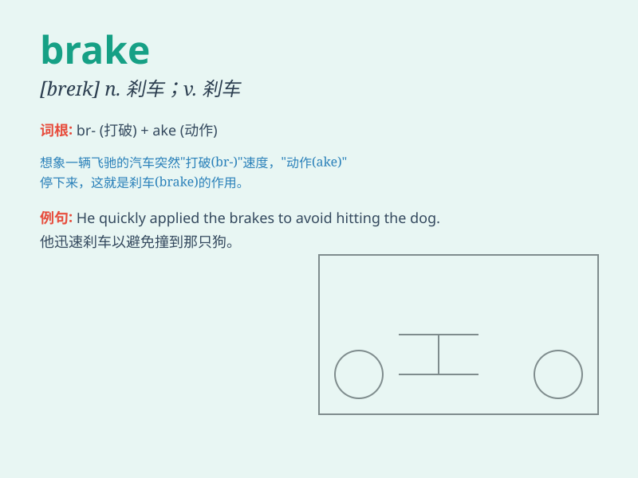

## brake

**英音:** _[breɪk]_ **美音:** _[brek]_

**译义:** *n.闸,刹车v.刹车*

### 短语

+ **apply the brake:** _踩刹车_

+ **put on the brake:** _刹车_

+ **brake pedal:** _刹车踏板_

+ **brake system:** _制动系统_

+ **emergency brake:** _紧急刹车；紧急制动器_

### 例句

#### 例句1

> **The driver slammed on the brakes to avoid hitting the dog.**

**中文翻译:** 司机猛踩刹车以避免撞到狗。

**单词释义:** 刹车

#### 例句2

> **The bike\'s brakes need to be repaired.**

**中文翻译:** 这辆自行车的刹车需要修理。

**单词释义:** 刹车装置

#### 例句3

> **He applied the brakes gently as he approached the stop sign.**

**中文翻译:** 他在接近停车标志时轻轻地踩了刹车。

**单词释义:** 刹车；制动

### 背诵小故事

> A driver was speeding down the hill. Suddenly, he realized the danger
and stepped hard on the brake. The car screeched to a halt just in time,
avoiding a crash. Remember, \'brake\' stops the vehicle!

**一位司机正在飞速冲下山。突然，他意识到危险，猛踩刹车。汽车及时发出尖锐的声响停了下来，避免了一场碰撞。记住，\'brake\'就是让车辆停下来！**

### 图义

