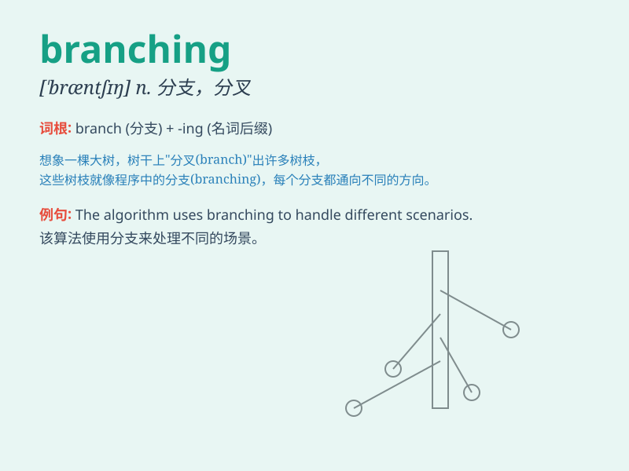

## branching

**英音:** _[\'bræntʃɪŋ]_ **美音:** _[\'bræntʃɪŋ]_

**译义:** *n.分歧adj.分歧的,发枝的*

### 短语

+ **branching pattern:** _分支模式_

+ **branching process:** _分支过程_

+ **branching structure:** _分支结构_

+ **branching system:** _分支系统_

+ **branching out:** _拓展；扩大范围_

### 例句

#### 例句1

> **The tree has many branching twigs.**

**中文翻译:** 这棵树有很多分叉的小树枝。

**单词释义:** 分叉；分支

#### 例句2

> **The river has a branching network of tributaries.**

**中文翻译:** 这条河有一个分支众多的支流网络。

**单词释义:** 分支；分岔

#### 例句3

> **The company is considering branching out into new markets.**

**中文翻译:** 公司正在考虑拓展到新的市场。

**单词释义:** 拓展；扩大（业务等）

### 背诵小故事

> A little monkey was climbing a big tree. It saw many branching paths
on the tree. It had to choose carefully to find the way to the top. The
branching paths made its journey full of challenges.

**一只小猴子正在爬一棵大树。它看到树上有很多分岔的路径。它必须仔细选择才能找到到达树顶的路。这些分岔的路径让它的旅程充满挑战。**

### 图义

