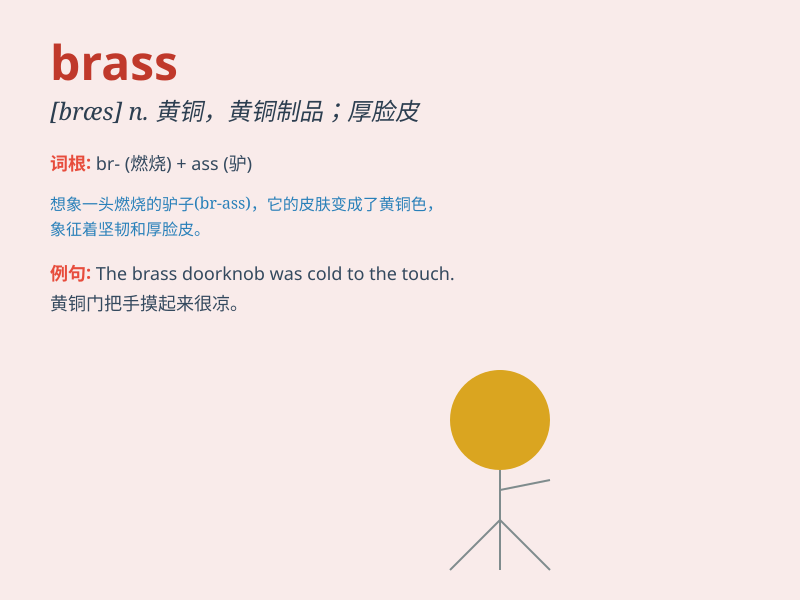

## brass

**英音:** _[brɑːs]_ **美音:** _[bræs]_

**译义:** *n.黄铜,黄铜制品,厚脸皮*

### 短语

+ **brass band:** _铜管乐队_

+ **brass tacks:** _实质问题；基本事实_

+ **top brass:** _高级官员；要员_

+ **brass monkey weather:** _极冷的天气_

+ **as bold as brass:** _厚颜无耻；极其胆大妄为_

### 例句

#### 例句1

> **The door handle was made of brass.**

**中文翻译:** 这个门把手是黄铜做的。

**单词释义:** 黄铜

#### 例句2

> **He has a lot of brass to ask for such a high salary.**

**中文翻译:** 他居然有胆量要求这么高的薪水。

**单词释义:** 胆量

#### 例句3

> **The brass band played a lively tune.**

**中文翻译:** 铜管乐队演奏了一首欢快的曲子。

**单词释义:** 铜管乐器

### 背诵小故事

> A brave soldier was awarded a medal made of brass. He wore it with
pride, as brass symbolized his courage. The shiny brass medal reminded
him of his heroic deeds in the battle.

**一位勇敢的士兵被授予了一枚黄铜制成的奖章。他自豪地佩戴着它，因为黄铜象征着他的勇气。这枚闪亮的黄铜奖章让他想起在战斗中的英勇事迹。**

### 图义

