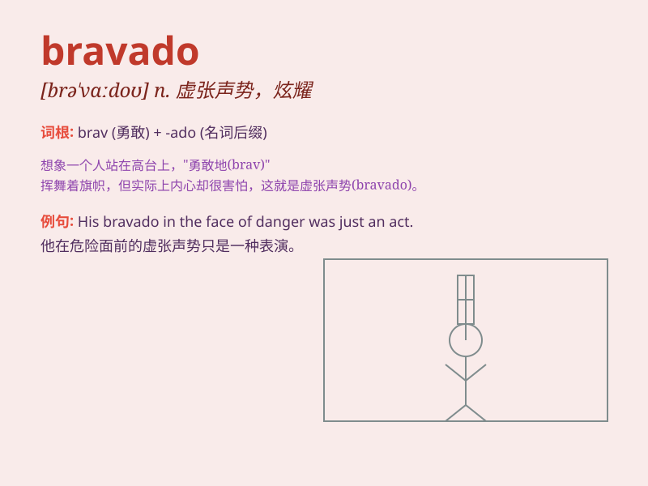

## bravado

**英音:** _[brə\'vɑːdəʊ]_ **美音:** _[brə\'vɑdo]_

**译义:** *n.虚张声势,装作有自信的样子*

### 短语

+ **false bravado:** _虚假的虚张声势_

+ **mere bravado:** _纯粹的虚张声势_

+ **show bravado:** _表现出虚张声势_

+ **bravado act:** _虚张声势的行为_

+ **bravado display:** _虚张声势的展示_

### 例句

#### 例句1

> **His bravado was all show; deep down, he was actually quite
scared.**

**中文翻译:**
他的虚张声势只是表面现象；实际上，在内心深处他非常害怕。

**单词释义:** 虚张声势

#### 例句2

> **Despite his bravado, he knew the task would be difficult.**

**中文翻译:** 尽管他故作勇敢，但他知道这个任务会很困难。

**单词释义:** 故作勇敢

#### 例句3

> **She faced the challenge with bravado, but later confessed her
nervousness.**

**中文翻译:** 她以逞能的姿态面对挑战，但后来承认了自己的紧张。

**单词释义:** 逞能

### 背诵小故事

> A young knight showed bravado in the battle. He charged forward
fearlessly, but it was not real bravery. It was just bravado to impress
others. Later, he learned true courage.

**一位年轻的骑士在战斗中表现出虚张声势。他无所畏惧地向前冲，但这不是真正的勇敢。这只是为了给别人留下深刻印象的虚张声势。后来，他学会了真正的勇气。**

### 图义

