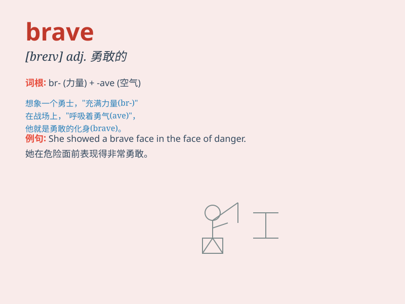

## brave

**英音:** _[breɪv]_ **美音:** _[brev]_

**译义:** *adj.勇敢的*

### 短语

+ **be brave:** _勇敢；有勇气_

+ **brave new world:** _美好的新世界_

+ **brave heart:** _勇敢的心_

+ **put on a brave face:** _强装自信快乐_

+ **brave the elements:** _不顾恶劣天气；冒着风雨_

### 例句

#### 例句1

> **The brave soldier risked his life to save his comrades.**

**中文翻译:** 这位勇敢的士兵冒着生命危险去救他的战友。

**单词释义:** 勇敢的（形容士兵）

#### 例句2

> **She was brave enough to face the difficulties alone.**

**中文翻译:** 她足够勇敢去独自面对困难。

**单词释义:** 勇敢的（形容人的品质）

#### 例句3

> **It was a brave decision to start a new business in such a tough
market.**

**中文翻译:** 在如此艰难的市场中开办新业务是一个勇敢的决定。

**单词释义:** 勇敢的（形容决定）

### 背诵小故事

> A young knight named Arthur was always brave. One day, a fierce
dragon attacked the village. Arthur didn\'t run away. He faced the
dragon bravely and saved everyone. Remember Arthur to remember the word
\'brave\'.

**一位名叫亚瑟的年轻骑士总是很勇敢。有一天，一只凶猛的龙袭击了村庄。亚瑟没有逃跑。他勇敢地面对巨龙并拯救了所有人。记住亚瑟就能记住'brave'这个单词。**

### 图义

