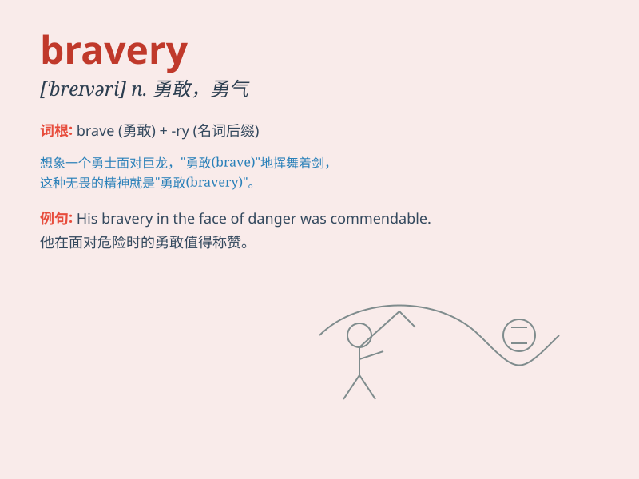

## bravery

**英音:** _[\'breɪv(ə)rɪ]_ **美音:** _[\'brevəri]_

**译义:** *n.勇敢*

### 短语

+ **act of bravery:** _勇敢的行为_

+ **show bravery:** _展现勇敢_

+ **great bravery:** _极大的勇敢_

+ **admire bravery:** _钦佩勇敢_

+ **courage and bravery:** _勇气和勇敢_

### 例句

#### 例句1

> **His bravery in the face of danger was remarkable.**

**中文翻译:** 他在危险面前的勇敢非常了不起。

**单词释义:** 勇敢，勇气

#### 例句2

> **The soldier was awarded for his bravery.**

**中文翻译:** 这名士兵因勇敢而被授予奖励。

**单词释义:** 勇敢

#### 例句3

> **Her bravery inspired everyone around her.**

**中文翻译:** 她的勇敢激励了她周围的每一个人。

**单词释义:** 勇敢

### 背诵小故事

> A soldier was in a fierce battle. Despite the danger and chaos, he
charged forward without hesitation. His actions showed true bravery. He
wasn\'t afraid and fought for his comrades and country.

**一名士兵身处激烈的战斗中。尽管危险和混乱，他毫不犹豫地向前冲。他的行为展现了真正的勇敢。他毫不畏惧，为他的战友和国家而战。**

### 图义

