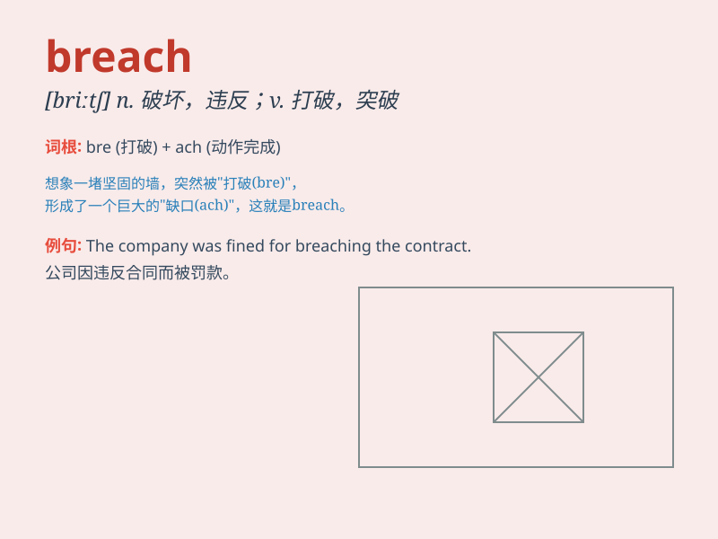

## breach

**英音:** _[briːtʃ]_ **美音:** _[britʃ]_

**译义:** *n.违背,破坏,破裂,裂口vt.打破,突破*

### 短语

+ **breach of contract:** _违约；违反合同_

+ **breach of trust:** _背信；违反信托_

+ **breach of peace:** _扰乱治安_

+ **breach of security:** _安全漏洞；违反安全规定_

+ **breach of duty:** _失职；违反职责_

### 例句

#### 例句1

> **The company was fined for breaching safety regulations.**

**中文翻译:** 这家公司因违反安全规定而被罚款。

**单词释义:** 违反

#### 例句2

> **The dam was in danger of breaching after the heavy rain.**

**中文翻译:** 大雨过后，大坝有决堤的危险。

**单词释义:** 破裂；决口

#### 例句3

> **He was accused of breaching the terms of the contract.**

**中文翻译:** 他被指控违反合同条款。

**单词释义:** 违背

### 背诵小故事

> A soldier was guarding the city wall. One night, an enemy climbed
over and made a breach in the wall. The soldier was shocked and quickly
raised the alarm. Thanks to him, the city was saved from a big disaster.

**一名士兵正在守卫城墙。一天晚上，一个敌人爬了过来，在城墙上弄出了一个缺口。士兵震惊了，迅速拉响警报。多亏了他，这座城市才免于一场大灾难。**

### 图义

