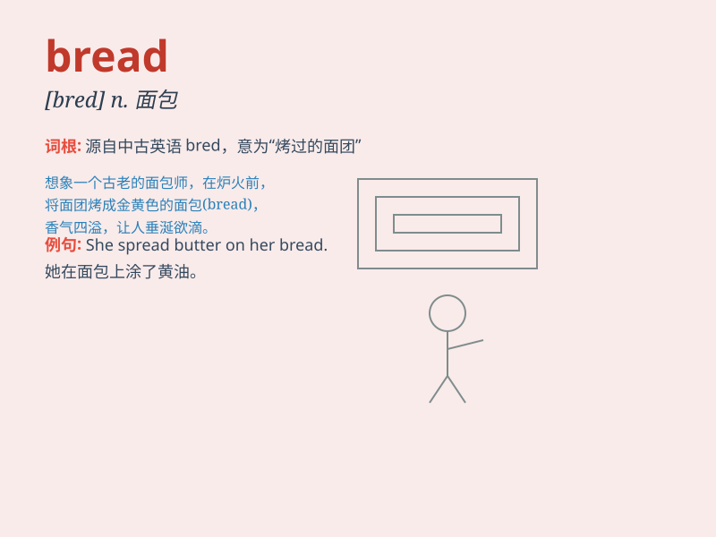

## bread

**英音:** _[bred]_ **美音:** _[brɛd]_

**译义:** *n.面包,生计*

### 短语

+ **bread and butter:** _生计；主要收入来源_

+ **a loaf of bread:** _一条面包_

+ **breadwinner:** _养家糊口的人_

+ **out of bread:** _失业；穷困_

+ **bread knife:** _面包刀_

### 例句

#### 例句1

> **I had a slice of bread for breakfast.**

**中文翻译:** 我早餐吃了一片面包。

**单词释义:** 面包

#### 例句2

> **The baker is making fresh bread.**

**中文翻译:** 面包师正在做新鲜的面包。

**单词释义:** 面包

#### 例句3

> **She spread butter on the bread.**

**中文翻译:** 她在面包上涂了黄油。

**单词释义:** 面包

### 背诵小故事

> One day, a hungry mouse was looking for food. It finally found a big
loaf of bread on the table. The bread was so delicious that the mouse
ate it happily and felt full.

**有一天，一只饥饿的老鼠正在寻找食物。它终于在桌子上发现了一大块面包。面包太美味了，老鼠开心地吃了起来，并且感到饱饱的。**

### 图义

