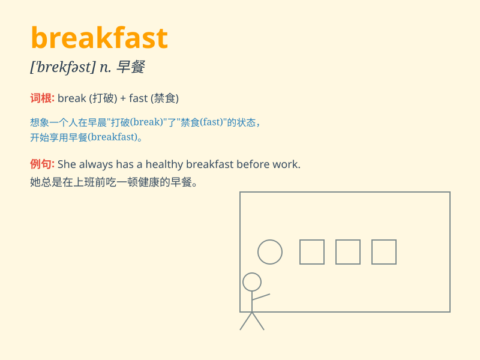

## breakfast

**英音:** _[\'brekfəst]_ **美音:** _[\'brɛkfəst]_

**译义:** *n.早餐vi.进早餐*

### 短语

+ **have breakfast:** _吃早餐_

+ **skip breakfast:** _不吃早餐；跳过早餐_

+ **continental breakfast:** _欧式早餐_

+ **English breakfast:** _英式早餐_

+ **breakfast table:** _早餐桌_

### 例句

#### 例句1

> **I have breakfast at seven every morning.**

**中文翻译:** 我每天早上七点吃早餐。

**单词释义:** 早餐

#### 例句2

> **She made a delicious breakfast for us.**

**中文翻译:** 她为我们做了一顿美味的早餐。

**单词释义:** 早餐

#### 例句3

> **After breakfast, he went to work.**

**中文翻译:** 早餐后，他去上班了。

**单词释义:** 早餐

### 背诵小故事

> One morning, a hungry boy woke up and rushed to the table. He broke
the fast of the night by eating bread, eggs, and milk. This meal was
called breakfast, the first food to end the period of not eating.

**一天早上，一个饥饿的男孩醒来后冲向餐桌。他通过吃面包、鸡蛋和牛奶打破了夜晚的禁食。这顿饭被称为早餐，是结束未进食时段的第一餐。**

### 图义

