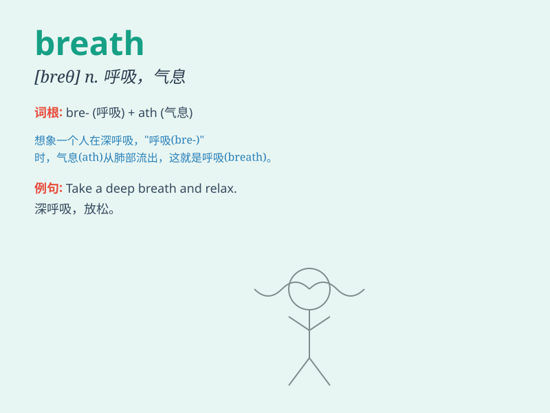

## breath

**英音:** _[breθ]_ **美音:** _[brɛθ]_

**译义:** *n.呼吸,气息,气味,空气,微风,暂停,瞬间*

### 短语

+ **take a breath:** _吸一口气；歇口气_

+ **out of breath:** _上气不接下气；喘不过气来_

+ **hold one\'s breath:** _屏住呼吸_

+ **short of breath:** _呼吸短促_

+ **catch one\'s breath:** _喘口气；恢复正常呼吸_

### 例句

#### 例句1

> **I took a deep breath before starting the speech.**

**中文翻译:** 在开始演讲之前我深吸了一口气。

**单词释义:** 呼吸

#### 例句2

> **The cold air was hurting my breath.**

**中文翻译:** 冷空气刺痛了我的呼吸。

**单词释义:** 呼吸

#### 例句3

> **His breath smelled of garlic.**

**中文翻译:** 他的呼吸里有大蒜味。

**单词释义:** 呼出的气

### 背诵小故事

> A brave knight was running in a forest. After a long race, he
stopped, breathing heavily. He felt each breath was precious as it gave
him the strength to continue his adventure.

**一位勇敢的骑士在森林中奔跑。经过长时间的奔跑，他停了下来，喘着粗气。他觉得每一口气都很珍贵，因为这给了他继续冒险的力量。**

### 图义

