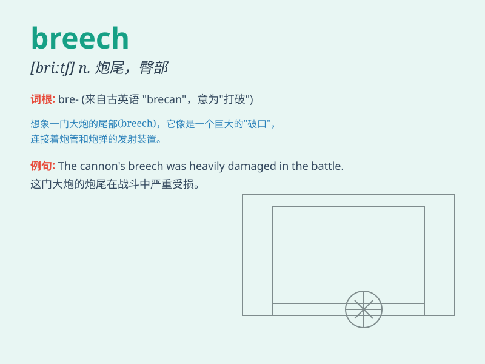

## breech

**英音:** _[briːtʃ]_ **美音:** _[britʃ]_

**译义:** *n.臀部*

### 短语

+ **breech birth:** _臀位分娩_

+ **breech loading:** _后膛装填_

+ **breech block:** _枪闩；炮闩_

+ **breech presentation:** _臀先露_

+ **breech cloth:** _尿布；缠腰布_

### 例句

#### 例句1

> **The baby was in the breech position during delivery.**

**中文翻译:** 分娩时婴儿处于臀位。

**单词释义:** 臀位

#### 例句2

> **The gun\'s breech needed to be cleaned after firing.**

**中文翻译:** 射击后需要清洁枪的后膛。

**单词释义:** 后膛

#### 例句3

> **He struggled to fix the breech in the machinery.**

**中文翻译:** 他费力地修复机器上的后膛。

**单词释义:** 裂缝

### 背诵小故事

> A baby was coming into the world, but in a tricky position -- its
bottom was first, a breech birth. The doctor had to act quickly to
ensure a safe delivery.

**一个婴儿即将出生，但胎位很棘手------臀部先出来，这是臀位生产。医生必须迅速行动以确保安全分娩。**

### 图义

