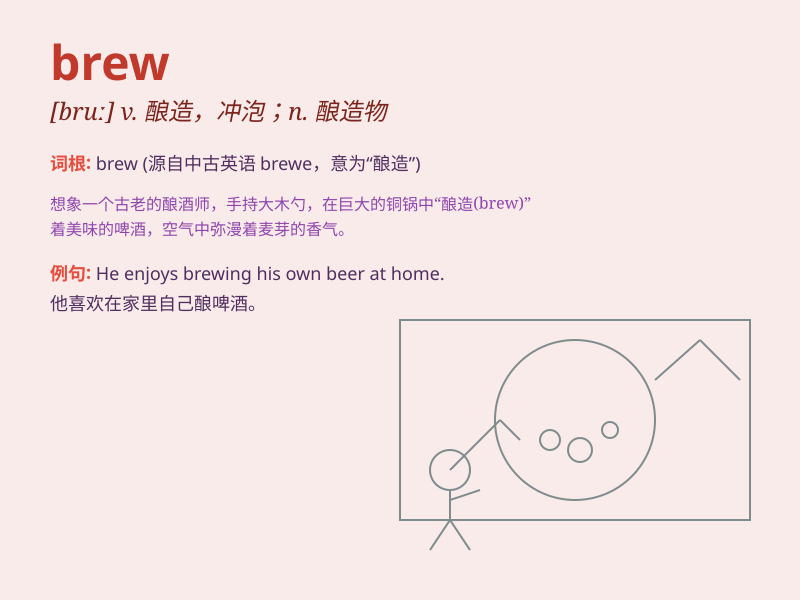

## brew

**英音:** _[bruː]_ **美音:** _[brʊ]_

**译义:** *v.酿造,酝酿*

### 短语

+ **brew up:** _沏茶；煮咖啡_

+ **brew trouble:** _惹麻烦；制造纠纷_

+ **brew a storm:** _酝酿一场风暴（常指局势紧张或可能出现问题）_

+ **home brew:** _家酿啤酒；自制的东西_

+ **brew something up from scratch:** _从头开始制作某物_

### 例句

#### 例句1

> **He brews his own coffee every morning.**

**中文翻译:** 他每天早上自己煮咖啡。

**单词释义:** 煮（咖啡等）

#### 例句2

> **A storm is brewing on the horizon.**

**中文翻译:** 一场风暴正在地平线上酝酿。

**单词释义:** 酝酿；即将来临

#### 例句3

> **The witch was said to brew potions in her cauldron.**

**中文翻译:** 据说女巫在她的大锅里酿造药剂。

**单词释义:** 调制（药水等）

### 背诵小故事

> One day, a little boy wanted to make a special drink. He collected
various ingredients and started to brew it. After a while, a wonderful
aroma filled the room. The boy successfully brewed a unique and
delicious drink!

**一天，一个小男孩想制作一种特别的饮料。他收集了各种原料然后开始酿造。过了一会儿，一股美妙的香气充满了房间。男孩成功地酿造出了一种独特又美味的饮料！**

### 图义

