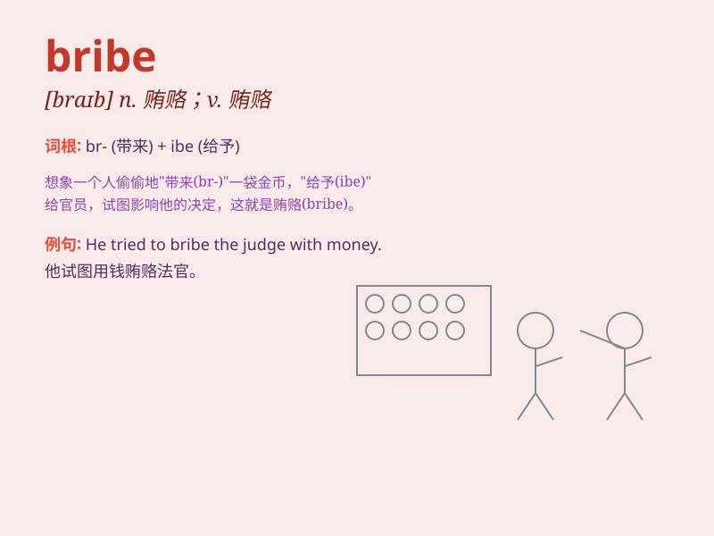

## bribe

**英音:** _[braɪb]_ **美音:** _[braɪb]_

**译义:** *n.贿赂vt.贿赂,向\...行贿*

### 短语

+ **accept a bribe:** _接受贿赂_

+ **offer a bribe:** _提供贿赂_

+ **bribe somebody to do something:** _贿赂某人做某事_

+ **political bribe:** _政治贿赂_

+ **commercial bribe:** _商业贿赂_

### 例句

#### 例句1

> **He was accused of accepting bribes from local businesses.**

**中文翻译:** 他被指控收受当地企业的贿赂。

**单词释义:** 贿赂（名词）

#### 例句2

> **The politician tried to bribe the judge to get a favorable
verdict.**

**中文翻译:** 这位政治家试图贿赂法官以获得有利的判决。

**单词释义:** 贿赂（动词）

#### 例句3

> **She refused to be bribed and reported the incident to the
authorities.**

**中文翻译:** 她拒绝接受贿赂，并向当局报告了这一事件。

**单词释义:** 贿赂（动词）

### 背诵小故事

> A corrupt official was always looking for bribes. One day, a
businessman offered him a bag of money as a bribe. But finally, they
were both caught. Remember, taking bribes is illegal!

**一个腐败的官员总是在寻找贿赂。有一天，一个商人给他一袋钱作为贿赂。但最后，他们都被抓住了。记住，收受贿赂是违法的！**

### 图义

