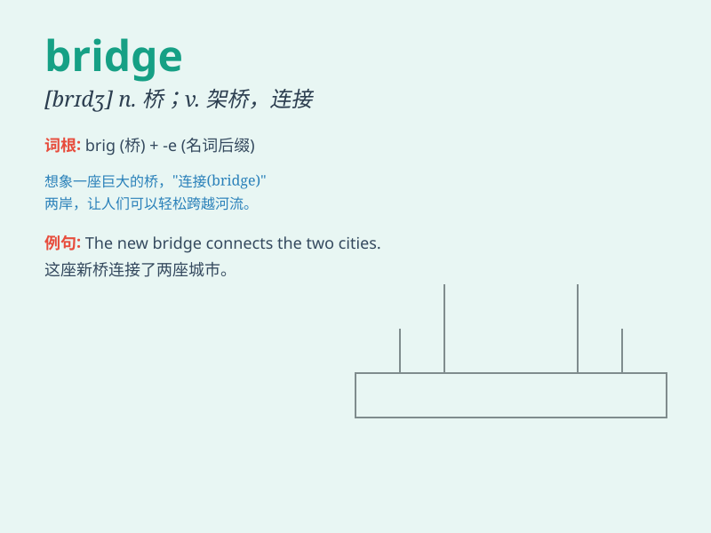

## bridge

**英音:** _[brɪdʒ]_ **美音:** _[brɪdʒ]_

**译义:** *n.桥,船桥,鼻梁,桥牌vt.架桥,渡过;网桥*

### 短语

+ **bridge the gap:** _消除隔阂；弥合差距_

+ **burn one\'s bridges:** _破釜沉舟；自断退路_

+ **cross the bridge when one comes to it:** _船到桥头自然直_

+ **stone bridge:** _石桥_

+ **wooden bridge:** _木桥_

### 例句

#### 例句1

> **The bridge across the river is very old.**

**中文翻译:** 河上的桥很古老了。

**单词释义:** 桥

#### 例句2

> **Music can bridge the gap between cultures.**

**中文翻译:** 音乐可以弥合文化之间的鸿沟。

**单词释义:** 弥合；消除（分歧）

#### 例句3

> **He tried to bridge his differences with his parents.**

**中文翻译:** 他试图弥合与父母的分歧。

**单词释义:** 消除（分歧）

### 背诵小故事

> A little mouse wanted to cross a river but couldn\'t swim. Luckily,
it found a bridge. It walked carefully on the bridge and finally reached
the other side safely. The bridge saved the mouse.

**一只小老鼠想要过河但不会游泳。幸运的是，它发现了一座桥。它小心翼翼地在桥上走，最后安全到达了对岸。这座桥救了老鼠。**

### 图义

