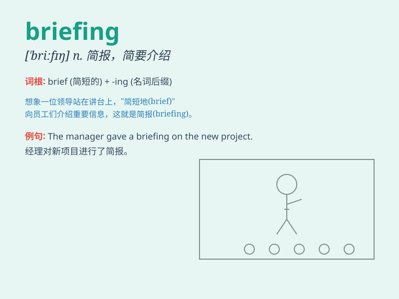

## briefing

**英音:** _[\'briːfɪŋ]_ **美音:** _[\'brifɪŋ]_

**译义:** *n.简报*

### 短语

+ **press briefing:** _新闻发布会_

+ **security briefing:** _安全简报_

+ **daily briefing:** _每日简报_

+ **intelligence briefing:** _情报简报_

+ **briefing session:** _简报会_

### 例句

#### 例句1

> **The manager gave a briefing on the new project to the team.**

**中文翻译:** 经理向团队简要介绍了新项目。

**单词释义:** 简报；情况介绍

#### 例句2

> **The pilot received a pre-flight briefing.**

**中文翻译:** 飞行员收到了飞行前简报。

**单词释义:** 情况通报

#### 例句3

> **A briefing was held to update the staff on company policies.**

**中文翻译:** 举行了简报会，向员工通报公司政策的最新情况。

**单词释义:** 简报会

### 背诵小故事

>
想象一下，一位将军正在进行一场紧急的军事行动。在行动前，他召集士兵们开了一个短会，快速传达重要信息，这个短会就是
briefing。它就像一个浓缩的信息传递时刻，让大家迅速了解关键要点。

**想象一位将军在军事行动前召集士兵开短会快速传达重要信息来辅助记忆单词
briefing，意思是简要情况介绍会；简报**

### 图义

