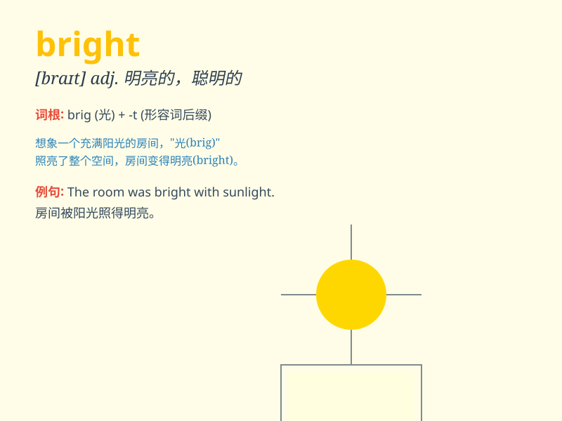

## bright

**英音:** _[braɪt]_ **美音:** _[braɪt]_

**译义:** *adj.明亮的,辉煌的,欢快的,聪明的,伶俐的*

### 短语

+ **bright idea:** _好主意，聪明的想法_

+ **bright color:** _鲜艳的颜色_

+ **bright future:** _光明的未来_

+ **bright light:** _明亮的光线_

+ **bright smile:** _灿烂的笑容_

### 例句

#### 例句1

> **The bright sun shone through the window.**

**中文翻译:** 明亮的阳光透过窗户照进来。

**单词释义:** 明亮的

#### 例句2

> **She has a bright smile.**

**中文翻译:** 她有着灿烂的笑容。

**单词释义:** 灿烂的

#### 例句3

> **The future looks bright for him.**

**中文翻译:** 他的未来看起来一片光明。

**单词释义:** 充满希望的

### 背诵小故事

> One night, when I was lost in the forest, I saw a bright star. It
guided me out. The star\'s bright light was like a hope, making the dark
forest less scary. Remember, bright means shining and full of light.

**一天晚上，当我在森林里迷路时，我看到了一颗明亮的星星。它指引我走了出去。这颗星星的明亮光芒就像希望，让黑暗的森林不再那么可怕。记住，bright
意思是闪耀的、充满光亮的。**

### 图义

