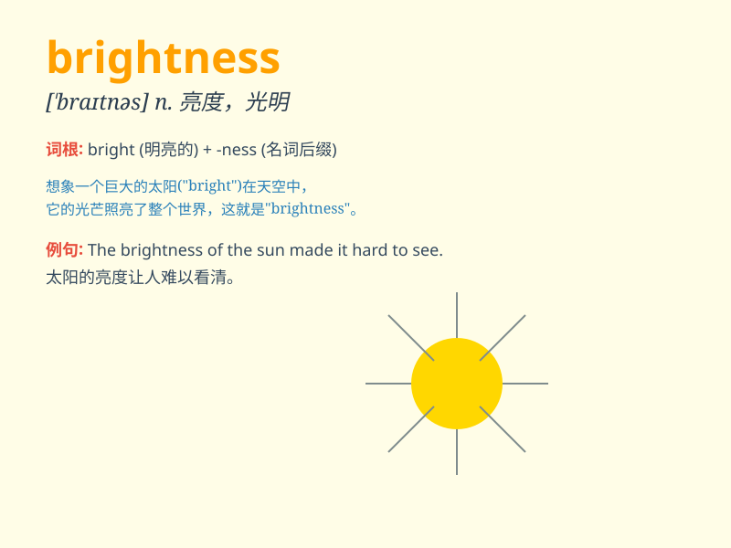

## brightness

**英音:** _[\'braɪtnɪs]_ **美音:** _[\'braɪtnɪs]_

**译义:** *n.光亮,明亮,聪明,智慧,[光]亮度*

### 短语

+ **high brightness:** _高亮度_

+ **low brightness:** _低亮度_

+ **adjust brightness:** _调节亮度_

+ **screen brightness:** _屏幕亮度_

+ **brightness level:** _亮度级别_

### 例句

#### 例句1

> **The brightness of the sun is blinding.**

**中文翻译:** 太阳的亮度令人目眩。

**单词释义:** 亮度

#### 例句2

> **Adjust the brightness of the screen for better viewing.**

**中文翻译:** 调整屏幕亮度以获得更好的观看效果。

**单词释义:** 亮度

#### 例句3

> **The brightness of her smile lit up the room.**

**中文翻译:** 她灿烂的笑容照亮了整个房间。

**单词释义:** 光彩；明亮

### 背诵小故事

> One night, a little boy was lost in the forest. Suddenly, he saw a
light. It was the brightness of a lantern held by a kind rescuer. The
light guided him home. Remember, \'brightness\' is like that saving
light.

**一天晚上，一个小男孩在森林里迷路了。突然，他看到了一束光。那是一位好心的救援者拿着的灯笼的光亮。这束光引导他回了家。记住，\'brightness\'
就像那束救命的光。**

### 图义

