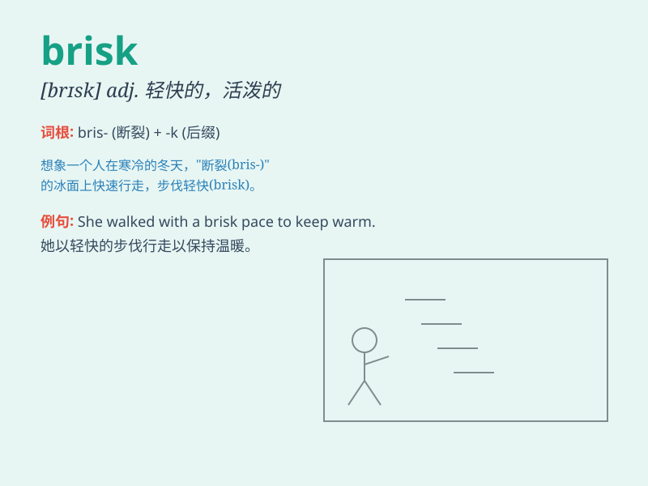

## brisk

**英音:** _[brɪsk]_ **美音:** _[brɪsk]_

**译义:** *adj.敏锐的,凛冽的,轻快的,活泼的vt.使活泼vi.活跃起来*

### 短语

+ **brisk walk:** _轻快的散步_

+ **brisk business:** _兴隆的生意_

+ **brisk pace:** _轻快的步伐_

+ **brisk trade:** _活跃的贸易_

+ **brisk market:** _繁荣的市场_

### 例句

#### 例句1

> **She took a brisk walk in the park to get some exercise.**

**中文翻译:** 她在公园里快步散步以锻炼身体。

**单词释义:** 轻快的

#### 例句2

> **The brisk wind made me shiver.**

**中文翻译:** 凛冽的风吹得我瑟瑟发抖。

**单词释义:** 凛冽的；清新的

#### 例句3

> **Business has been brisk this month.**

**中文翻译:** 这个月生意很红火。

**单词释义:** 兴隆的；繁忙的

### 背诵小故事

> A brisk wind blew through the town. A girl was briskly walking, full
of energy. She quickly crossed the street to meet her friend. The word
\'brisk\' means lively and quick.

**一阵轻快的风吹过小镇。一个女孩精神饱满地快步走着。她迅速穿过街道去见她的朋友。单词\'brisk\'意思是轻快的，活泼的。**

### 图义

