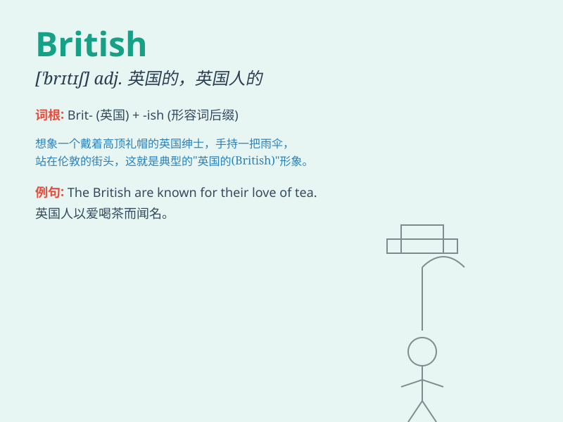

## British

**英音:** _[ˈbrɪtɪʃ]_ **美音:** _[ˈbrɪtɪʃ]_

**译义:**
*adj.英国的;英国人的;大不列颠的;大不列颠人的n.英国人;英国英语*

### 短语

+ **British Isles:** _不列颠群岛_

+ **British English:** _英式英语_

+ **British Museum:** _大英博物馆_

+ **British Airways:** _英国航空公司_

+ **British Columbia:** _不列颠哥伦比亚（加拿大省份）_

### 例句

#### 例句1

> **The British are known for their love of tea.**

**中文翻译:** 英国人以爱喝茶而闻名。

**单词释义:** 英国的；英国人的

#### 例句2

> **British Airways is one of the major airlines in the world.**

**中文翻译:** 英国航空公司是世界上主要的航空公司之一。

**单词释义:** 英国的

#### 例句3

> **He has a British accent.**

**中文翻译:** 他有英国口音。

**单词释义:** 英国的

### 背诵小故事

> Once upon a time, there was a traveler who met a friendly man. The
man said, \'I\'m British.\' The traveler understood that he was from the
United Kingdom. Later, the traveler always remembered the word
\'British\' when thinking of this encounter.

**从前，有一位旅行者遇到了一个友好的人。这个人说：'我是英国人。'旅行者明白了他来自英国。后来，每当旅行者想起这次相遇，总是能记住'British'这个词。**

### 图义

