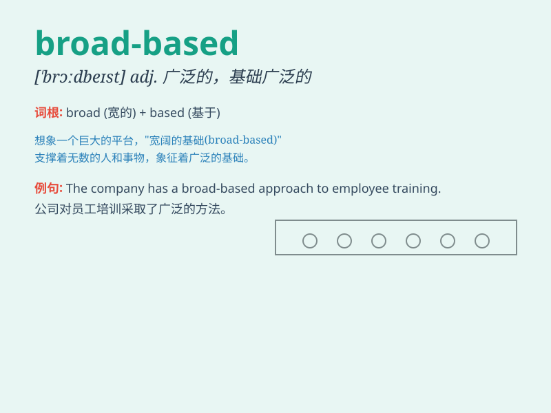

## broad-based

**英音:** _[ˈbrɔːd ˈbeɪsɪd]_ **美音:** _[ˈbrɔd ˈbeɪsɪd]_

**译义:** *以广泛的基础为支撑的；有广泛支持的*

### 短语

+ **broad-based economy:** _基础广泛的经济_

+ **broad-based support:** _广泛的支持_

+ **broad-based education:** _基础广泛的教育_

+ **broad-based coalition:** _基础广泛的联盟_

+ **broad-based approach:** _基础广泛的方法_

### 例句

#### 例句1

> **The new economic policy is broad-based and aims to benefit all
sectors of society.**

**中文翻译:** 新的经济政策基础广泛，旨在造福社会的所有部门。

**单词释义:** 基础广泛的

#### 例句2

> **We need a broad-based education system to produce well-rounded
students.**

**中文翻译:** 我们需要一个基础广泛的教育体系来培养全面发展的学生。

**单词释义:** 基础广泛的

#### 例句3

> **The company\'s success is built on a broad-based customer
base.**

**中文翻译:** 这家公司的成功建立在基础广泛的客户群之上。

**单词释义:** 基础广泛的

### 背诵小故事

> Imagine a huge, wide tree with a base that spreads out widely. It
supports many branches and leaves. Just like this tree, \'broad-based\'
means having a wide or extensive foundation or support. For example, a
broad-based economic policy covers many aspects.

**想象一棵巨大的树，有着宽阔伸展的根基。它支撑着许多树枝和树叶。就像这棵树一样，\'broad-based\'意思是有着广泛的基础或支持。例如，广泛基础的经济政策涵盖了许多方面。**

### 图义

