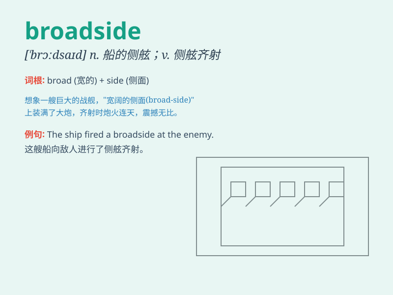

## broadside

**英音:** _[\'brɔːdsaɪd]_ **美音:** _[\'brɔdsaɪd]_

**译义:** *n.舷侧,较宽的一面adj.全面的adv.侧面地*

### 短语

+ **broadside attack:** _侧舷攻击；侧翼攻击_

+ **fire a broadside:** _舷炮齐发；猛烈抨击_

+ **take a broadside:** _遭受侧面攻击；受到严厉批评_

+ **broadside on:** _侧对着_

+ **broadside collision:** _侧面碰撞_

### 例句

#### 例句1

> **The ship was hit broadside by a huge wave.**

**中文翻译:** 这艘船被一个巨浪从侧面击中。

**单词释义:** 侧面

#### 例句2

> **The politician delivered a broadside against his opponents.**

**中文翻译:** 这位政治家对他的对手进行了猛烈抨击。

**单词释义:** 猛烈抨击

#### 例句3

> **The car skidded broadside into the ditch.**

**中文翻译:** 汽车横着滑进了沟里。

**单词释义:** 横着

### 背诵小故事

> A pirate ship was attacked by another. The enemy fired all their
cannons in one broadside, causing huge damage. It was a fierce battle at
sea.

**一艘海盗船遭到另一艘的攻击。敌人一次性用一侧的所有大炮开火（broadside），造成了巨大的破坏。这是一场海上的激烈战斗。**

### 图义

