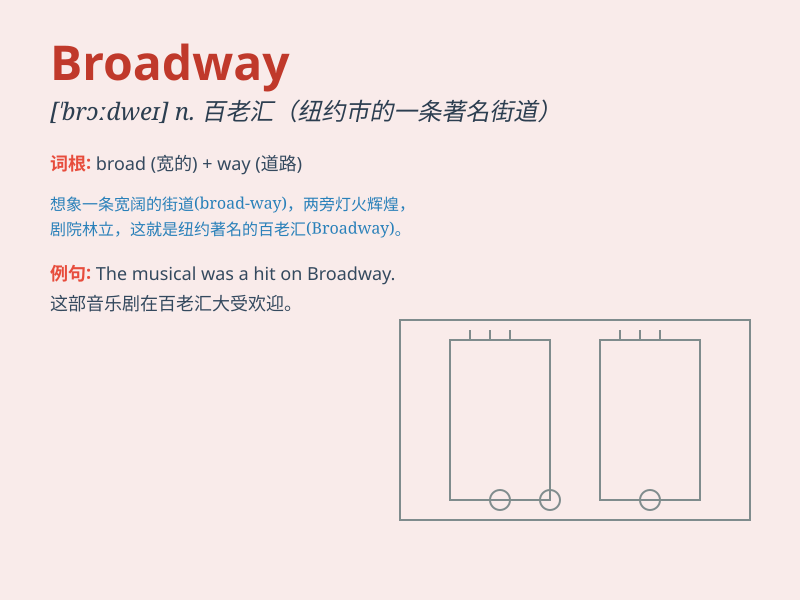

## Broadway

**英音:** _[ˈbrɔːdweɪ]_ **美音:** _[ˈbrɔdweɪ]_

**译义:** *n.百老汇（美国纽约市著名的大街，以剧院著称）*

### 短语

+ **Broadway musical:** _百老汇音乐剧_

+ **Broadway show:** _百老汇演出_

+ **Broadway hit:** _百老汇热门作品_

+ **off-Broadway:** _非百老汇的；外百老汇的_

+ **Broadway legend:** _百老汇传奇_

### 例句

#### 例句1

> **I dream of performing on Broadway one day.**

**中文翻译:** 我梦想有一天能在百老汇演出。

**单词释义:**
百老汇（美国纽约市的一条街道，以众多剧院和音乐剧、戏剧演出而闻名）

#### 例句2

> **The play became a hit on Broadway.**

**中文翻译:** 这出戏在百老汇大获成功。

**单词释义:** 百老汇

#### 例句3

> **She\'s a rising star on Broadway.**

**中文翻译:** 她是百老汇一颗冉冉升起的新星。

**单词释义:** 百老汇

### 背诵小故事

> A young artist dreams of performing on Broadway. One day, he gets a
chance and shines brightly on the big stage. Broadway becomes the path
to his success and fame.

**一位年轻的艺术家梦想在百老汇演出。有一天，他得到了一个机会，并在大舞台上大放异彩。百老汇成为了他成功和成名的道路。**

### 图义

