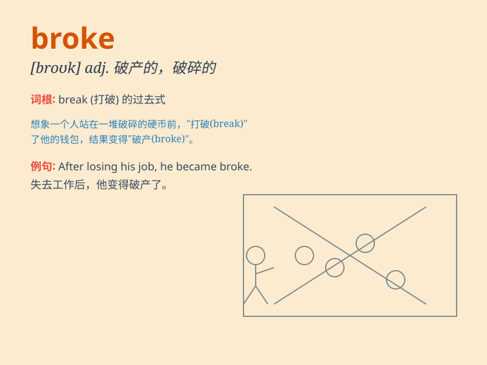

## broke

**英音:** _[brəʊk]_ **美音:** _[brok]_

**译义:** *adj.一文不名的 vbl.break的过去式*

### 短语

+ **broke out:** _（战争、火灾、疾病等）爆发_

+ **broke up:** _（使）破碎；（使）破裂；分手；（学校）放假_

+ **broke away:** _突然离开；脱离；逃跑_

+ **broke down:**
_（机器或车辆）出故障；（讨论、关系等）失败；（身体）垮掉_

+ **broke in:** _闯入；打断；插嘴_

### 例句

#### 例句1

> **He went broke after investing all his money in that risky
business.**

**中文翻译:** 在把所有的钱都投资到那个有风险的生意之后，他破产了。

**单词释义:** 破产的

#### 例句2

> **The machine broke down and needed to be repaired.**

**中文翻译:** 这台机器坏了，需要修理。

**单词释义:** （机器等）出故障

#### 例句3

> **She broke the news to him gently.**

**中文翻译:** 她委婉地把消息透露给他。

**单词释义:** 透露；传开

### 背诵小故事

> A poor man was always in trouble. One day, he found all his money was
gone and he became broke. He had no choice but to start over and work
hard to get out of this situation.

**一个穷人总是陷入困境。有一天，他发现自己所有的钱都没了，变得身无分文。他别无选择，只能重新开始，努力工作摆脱这种状况。**

### 图义

