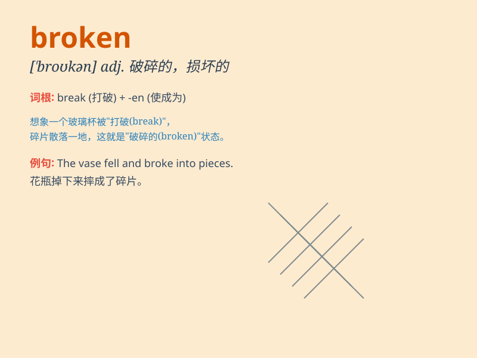

## broken

**英音:** _[\'brəʊk(ə)n]_ **美音:** _[\'brokən]_

**译义:** *adj.坏掉的,患病的,被制服的,断掉的 vbl.break的过去分词*

### 短语

+ **broken heart:** _破碎的心；伤心_

+ **broken line:** _折线；虚线_

+ **broken English:** _蹩脚的英语_

+ **broken bone:** _骨折；断骨_

+ **broken promise:** _违背的诺言；未兑现的承诺_

### 例句

#### 例句1

> **The vase is broken.**

**中文翻译:** 这个花瓶碎了。

**单词释义:** 破碎的；损坏的

#### 例句2

> **His leg was broken in the accident.**

**中文翻译:** 他的腿在事故中断了。

**单词释义:** 折断的；骨折的

#### 例句3

> **She has a broken heart.**

**中文翻译:** 她心碎了。

**单词释义:** （情感）破碎的；受伤的

### 背诵小故事

> One day, I was walking on the street and saw a broken bike. Its wheel
was bent and the chain was off. It looked so sad and helpless, just like
the word \'broken\' means something damaged or not working properly.

**有一天，我走在街上看到一辆坏掉的自行车。它的轮子弯了，链条也掉了。它看起来如此悲伤和无助，就像单词\'broken\'表示损坏或无法正常工作的意思。**

### 图义

