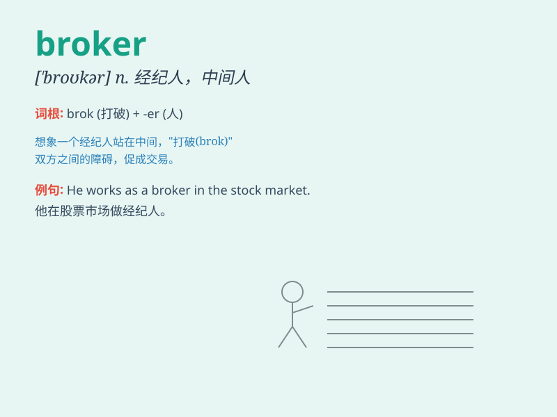

## broker

**英音:** _[ˈbrəʊkə(r)]_ **美音:** _[ˈbrokər]_

**译义:** *n.掮客,经纪人*

### 短语

+ **insurance broker:** _保险经纪人_

+ **stock broker:** _股票经纪人_

+ **broker deal:** _经纪业务_

+ **broker fee:** _经纪费_

+ **power broker:** _权力掮客_

### 例句

#### 例句1

> **The broker helped me find the perfect investment opportunity.**

**中文翻译:** 这位经纪人帮我找到了绝佳的投资机会。

**单词释义:** 经纪人

#### 例句2

> **He works as a real estate broker in the city.**

**中文翻译:** 他在这个城市里当房地产经纪人。

**单词释义:** 经纪人

#### 例句3

> **The insurance broker provided valuable advice on policies.**

**中文翻译:** 这位保险经纪人就保险政策提供了宝贵的建议。

**单词释义:** 经纪人

### 背诵小故事

> A poor man wanted to buy a house but had no idea how. Then a smart
broker came and helped him find the perfect one. The broker knew all the
ins and outs of the market.

**一个穷人想买房子但不知道怎么做。然后一个聪明的经纪人出现了，帮他找到了完美的房子。这个经纪人熟知市场的所有细节。**

### 图义

