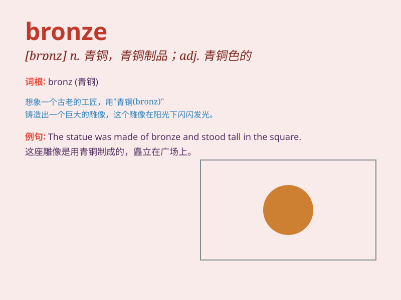

## bronze

**英音:** _[brɒnz]_ **美音:** _[brɑnz]_

**译义:** *n.青铜(铜与锡合金),铜像adj.青铜色的*

### 短语

+ **bronze medal:** _铜牌_

+ **bronze statue:** _铜像_

+ **bronze age:** _青铜时代_

+ **dark bronze:** _深古铜色_

+ **bronze skin:** _古铜色的皮肤_

### 例句

#### 例句1

> **The statue was cast in bronze.**

**中文翻译:** 这座雕像由青铜铸成。

**单词释义:** 青铜

#### 例句2

> **She won a bronze medal in the competition.**

**中文翻译:** 她在比赛中获得了铜牌。

**单词释义:** 铜牌

#### 例句3

> **His skin had a bronze tint from spending so much time
outdoors.**

**中文翻译:** 由于长时间在户外，他的皮肤呈古铜色。

**单词释义:** 古铜色

### 背诵小故事

> In an ancient competition, the athlete worked hard and won a
beautiful medal. The medal was not gold or silver but bronze. It shone
with a unique charm, representing the athlete\'s perseverance and
effort.

**在一场古代的竞赛中，运动员努力拼搏并赢得了一枚漂亮的奖牌。这枚奖牌不是金的也不是银的，而是青铜的。它闪耀着独特的魅力，代表着运动员的坚持不懈和努力。**

### 图义

